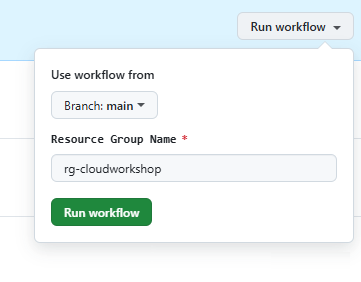
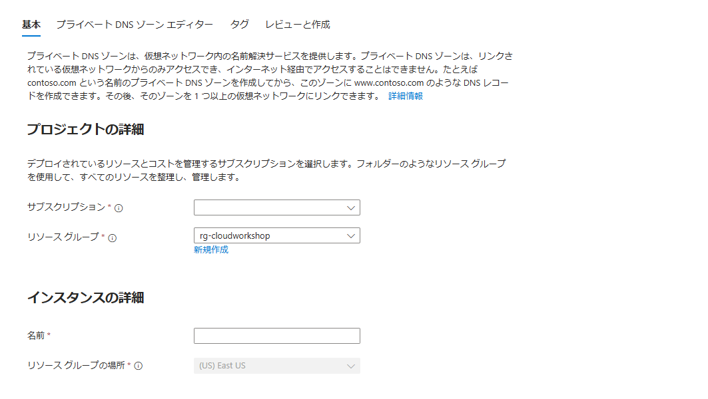
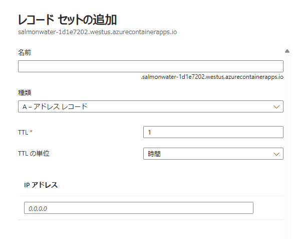
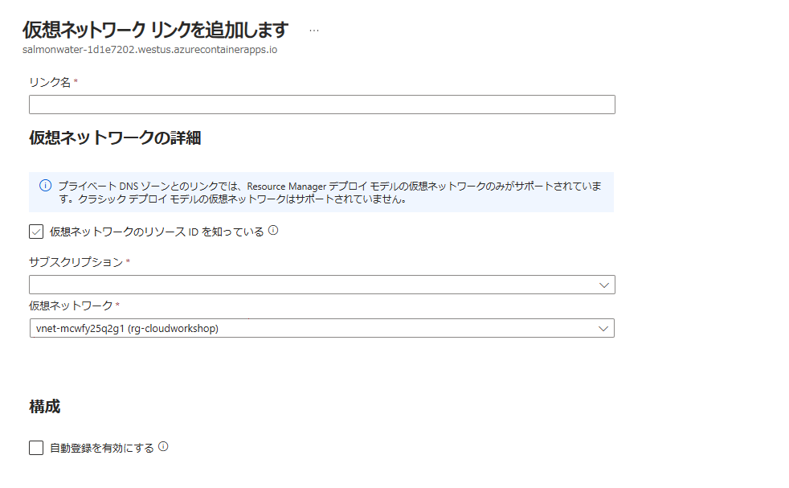
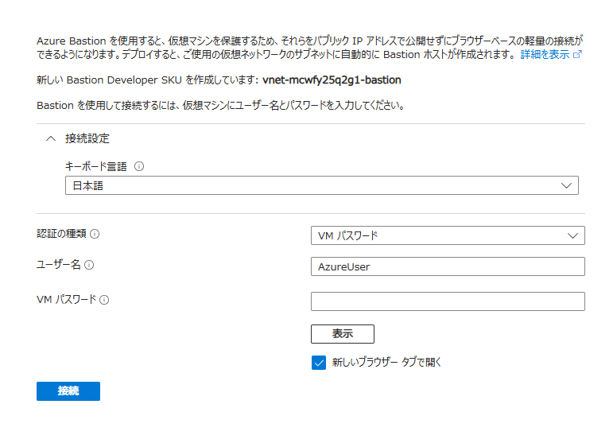

### 💡 参考情報

- [名前付け規則を定義する](https://learn.microsoft.com/ja-jp/azure/cloud-adoption-framework/ready/azure-best-practices/resource-naming)

- [Azure リソースの種類に推奨される省略形](https://learn.microsoft.com/ja-jp/azure/cloud-adoption-framework/ready/azure-best-practices/resource-abbreviations)

- [GitHub Actions を使用して Azure に接続する](https://learn.microsoft.com/ja-jp/azure/developer/github/connect-from-azure?tabs=azure-portal%2Cwindows)

- [Microsoft ID プラットフォームにアプリケーションを登録する](https://learn.microsoft.com/ja-jp/entra/identity-platform/quickstart-register-app?tabs=certificate)

- [Bicep と Azure CLI を使用してリソースをデプロイする方法](https://learn.microsoft.com/ja-jp/azure/azure-resource-manager/bicep/deploy-cli)

<br />

### 📝 索引

1. リソースの展開

    自動（GitHub Actions） または 手動（Bicep） のどちらかで展開

    - [GitHub Actions による一括展開](#1-a-github-actions-による一括展開)

    - [Bicep と Azure CLI を使用したリソースの展開](#1-b-bicep-と-azure-cli-を使用したリソースの展開)

1. [Private DNS Zone の作成](#2-private-dns-zone-の作成)

1. [仮想マシンの作成](#3-仮想マシンの作成)

1. [仮想マシンへの接続](#4-仮想マシンへの接続)

<br />

> GitHub Actions による一括展開、Azure CLI を使用しての個々のリソース展開の選択が可  
>
> Bastion の Developer SKU を使用する場合は、利用できるリージョンの事前確認が必要  
> (<a href="https://learn.microsoft.com/ja-jp/azure/bastion/quickstart-developer-sku">Azure Bastion をデプロイする ‐ Developer SKU</a>)  
>
> Embeddings モデルで text-embedding-3-small, text-embedding-3-large を使用する際は、利用できるリージョンの事前確認が必要  
> (<a href="https://learn.microsoft.com/ja-jp/azure/ai-services/openai/concepts/models?tabs=python-secure%2Cglobal-standard%2Cstandard-embeddings">Azure OpenAI Service models</a>)

<br />

## 事前準備環境


<br />

## 1-(a). GitHub Actions による一括展開

### 事前準備

- リポジトリのフォーク

  - **<a href="https://github.com/kohei3110/RAG-on-Azure-Hands-on-Lab">ワークショップのリポジトリ</a>** を自身のアカウントへ複製

- Microsoft Entra アプリケーションの登録

  - <a href="https://entra.microsoft.com/">Microsoft Entra 管理センター</a>にサインイン

  - **ID** > **アプリケーション** > **アプリの登録** に移動、**＋ 新規登録** をクリック

  - アプリケーションの表示名を入力し **登録** をクリックし、アプリ登録を完了

- 登録したアプリケーションにロールを割り当て

  - Azure Portalから **サブスクリプション** に遷移し、**アクセス制御 (IAM)** を選択
  
  - **追加** > **ロールの割り当ての追加** をクリックし、左記のステップで登録したアプリ（サービスプリンシパル）に対して **共同作成者** ロールを割り当て

  - （本番環境では必要最小限の権限を付与する必要あり、ここでは便宜的に共同作成者の権限を付与）

- フェデレーション資格情報を追加

  - 登録したアプリの構成画面から **証明書とシークレット** を選択

  - **フェデレーション資格情報** タブを選択し **＋ 資格情報の追加** をクリック

  - **フェデレーション資格情報のシナリオ** から **Azure リソースをデプロイする GitHub Actions** を選択

  - GitHub アカウントへの接続情報を入力
  
    - **組織**: GitHub アカウント名

    - **リポジトリ**: リポジトリ名 (RAG-on-Azure-Hands-on-Lab)

    - **エンティティ型**: ブランチ

    - **選択範囲に基づく**: main

    - **サブジェクト識別子**: （上記指定内容に応じて自動生成されます）
  
  - 資格情報の詳細を入力

    - **名前**: 任意
  
  - **追加** をクリックし、フェデレーション資格情報の追加を完了

- GitHub シークレットの作成

  - GitHub リポジトリへ移動、**Settings** タブを選択

  - **Security** > **Secrets and variables** > Actions を選択

  - **New repository secret** をクリックし、シークレットを追加

    - **AZURE_CLIENT_ID**: 登録したアプリケーションのアプリケーション (クライアント) ID

    - **AZURE_TENANT_ID**: テナント ID

    - **AZURE_SUBSCRIPTION_ID**: サブスクリプション ID
<br />

### リソースの展開

- <a href="https://portal.azure.com/">Azure Portal</a> からリソース グループを作成

- パラメーターの指定

  - GitHub リポジトリの **Code** から **bicep** > **parameters** 配下の .bicepparam ファイルに展開するリソースの情報を指定

    `// ChangeMe` コメントのある個所を修正

    - **ai.bicepparam**: AI Search と OpenAI Service アカウント

    - **container.bicepparam**: Log Anlaytics, Application Insights, Container Apps

    - **storageaccount.bicepparam**: ストレージ アカウント

    - **virtualnetwork_spoke.bicepparam**: 仮想ネットワーク

- ワークフローの実行

  - GitHub リポジトリの **Actions** タブを選択

  - **Actions** > **All workflows** > **Deploy Hands-on Resources** を選択

  - **Run workflow** を選択

  - Branch: main, Resource Group Name に展開先となるリソース グループ名を入力し **Run workflow** をクリック

    
  
  - ワークフローが正常に終了し、リソースが展開されたことを確認

<br />

## 1-(b). Bicep と Azure CLI を使用したリソースの展開

### 事前準備

- リポジトリのフォーク

  - **<a href="https://github.com/kohei3110/RAG-on-Azure-Hands-on-Lab">ワークショップのリポジトリ</a>** を自身のアカウントへ複製

- フォークしたリポジトリをローカル環境へクローン

<br />

### リソースの展開

- <a href="https://portal.azure.com/">Azure Portal</a> からリソース グループを作成

- パラメーター ファイルを使用する場合は、**bicep** > **parameters** 配下のファイルにリソースの情報を指定

  ※インライン パラメーターで parameters に値を指定する場合、この手順は不要

- az login を使用して Azure へ接続

- Bicep ファイルをデプロイ

  ※ クローンしたリポジトリ直下でコマンドを実行する以外は、.bicep, .bicepparam へのパスの修正が必要

  - **仮想ネットワーク**

    ```
    az deployment group create --resource-group <リソース グループ名> --template-file ./bicep/modules/virtualnetwork_spoke.bicep --parameters ./bicep/parameters/virtualnetwork_spoke.bicepparam
    ```

  - **Contaienr Registry, Container Apps**

    ```
    az deployment group create --resource-group <リソース グループ名> --template-file ./bicep/templates/container.bicep --parameters ./bicep/parameters/container.bicepparam
    ```

    ※ Container Apps Environment の展開のため、事前に仮想ネットワークの作成が必要

    ※ Log Analytics ワークスペース、Application Insights も作成

  
  - **AI Search, OpenAI Service**

    ```
    az deployment group create --resource-group <リソース グループ名> --template-file ./bicep/templates/ai.bicep --parameters ./bicep/parameters/ai.bicepparam
    ```
  
  - **Storage Account**

    ```
    az deployment group create --resource-group <リソース グループ名> --template-file ./bicep/modules/storageaccount.bicep --parameters ./bicep/parameters/storageaccount.bicepparam
    ```

<br />

#### ファイルのアップロード

- **contents** 配下のファイルを Blob コンテナへアップロード

  ```
  az storage blob upload-batch --account-name <ストレージ アカウント名> --destination <コンテナ名> --source ./contents
  ```

<br />

## 2. Private DNS Zone の作成

> 内部環境で作成した Container Apps Environment に展開した Container Apps に対して  
> 仮想ネットワーク内のリソースからアクセスするために必要な DNS の設定

- Container Apps の **アプリケーション URL** を確認

  https://<コンテナー アプリ名>.<ユニーク文字列>.<リージョン>.azurecontainerapps.io

- **<ユニーク文字列>.<リージョン>.azurecontainerapps.io** の名前でプライベート DNS ゾーンを作成

  

  > リソース グループ、リソース名の指定のみで作成

- 作成したプライベート DNS ゾーンに対して A レコードを登録

  - **名前**: コンテナー アプリ名

  - **種類**: A ‐ アドレス レコード

  - **TTL**: 1

  - **TTL の単位**: 時間

  - **IP アドレス**: Container Apps Environment に静的 IP として割り当てられた値

    

- 仮想ネットワーク リンクを追加

  

  > リンク名は任意で OK、仮想マシンを展開する仮想ネットワークへリンク

<br />

## 3. 仮想マシンの作成

<br />

## 4. 仮想マシンへの接続

### Bastion Developer SKU の利用

- **Bastion** ページで資格情報を入力し **接続** をクリック時に Bastion Developer SKU がデプロイされ Bastion 経由で仮想マシンへ接続

  

  ※ 以下のリージョンに展開した場合は、Bastion Developer SKU を利用可能 (2024年10月時点)

  - 米国中部 EUAP (CentralUSEUAP)

  - 米国東部 2 EUAP (EastUS2EUAP)

  - 米国中西部 (WestCentralUS)

  - 米国中北部 (NorthCentralUS)

  - 米国西部 (WestUS)

  - 北ヨーロッパ (NorthEurope)

<br />

### Bastion Basic SKU の利用

> Bastion Developer SKU が利用不可のリージョンの場合、Bastion Basic SKU を展開

- **bicep** > **parameters** 配下の **bastion.bicepparam** にリソースの情報を指定

- Azure CLI を使用してリソースを展開

    ```
    az deployment group create --resource-group <リソース グループ名> --template-file ./bicep/templates/bastion.bicep --parameters ./bicep/parameters/bastion.bicepparam
    ```

    ※ Bastion 展開用の仮想ネットワーク、および他のリソースを展開した仮想ネットワーク間との VNet Peering を作成
