Retrieval Augmented Generation (RAG) pattern for Azure AI Search  
Dec 2024

<br />

### Contents

- [環境準備](#環境準備)

- [Exercise 1: Azure AI Search の使用方法](#exercise-1-azure-ai-search-の使用方法)

  - [Task 1: インデックスの作成](#task-1-インデックスの作成)

  - [Task 2: インデックス、スキルセットの設定](#task-2-インデックススキルセットの設定)

  - [Task 3: インデックスの再作成](#task-3-インデックスの再作成)

  - [Task 4: 検索クエリの発行](#task-4-検索クエリの発行)

  - [Task 5: フルテキスト検索](#task-5-フルテキスト検索)

  - [Task 6: 高度な検索](#task-6-高度な検索)

  - [Task 7: デモ アプリの作成](#task-7-デモ-アプリの作成)

<br />

### 事前準備環境


<br />

## 環境準備


<br />

#### 仮想マシンへの接続

- [Azure ポータル](https://portal.azure.com/) から展開済みの仮想マシンへ管理ブレードを表示

- **接続** > **Bastion を介した接続** を選択

  

- ユーザー名、パスワードを入力し **接続** をクリック

  

- 新しいタブが開き、仮想マシンのデスクトップ画面が表示

  

  > 初回接続時にポップアップ ブロック機能により画面が表示されない場合:  
  > ポップアップ ブロックのアイコンをクリックし、ポップアップとリダイレクトを許可したのち再度接続を実行

<br />

#### GitHub リポジトリのフォーク

- Web ブラウザを起動、[ワークショップのリポジトリ](https://github.com/kohei3110/RAG-on-Azure-Hands-on-Lab) へアクセス

- **Fork** をクリック

  

- **Owner** に自身のアカウントが表示、**Copy the main branch only** にチェックがつけられていることを確認し **Create fork** をクリック

  

- リポジトリが複製されることを確認

  

<br />

#### リポジトリのクローン

- リポジトリの **Code** をクリック、表示されるツールチップよりリポジトリの URL をコピー

  

- Visual Studio Code を起動、サイドバーから **Explorer** を選択し **Clone Repository** をクリック

  

- リポジトリの URL にコピーした URL を貼り付け Enter キーを押下

  

- 複製先となるローカル ディレクトリを選択

  > GitHub の認証情報が求められた場合は、資格情報を入力し認証を実施

- クローンされたリポジトリを開きますか？のメッセージが表示されるので **Open** をクリック

  

- **Terminal** > **New Terminal** を選択

- git remote コマンドを実行し  クローン先である自身のアカウント名を含む URL が表示されることを確認

  ```
  git remote -v
  ```

<br />

## Exercise 1: Azure AI Search の使用方法

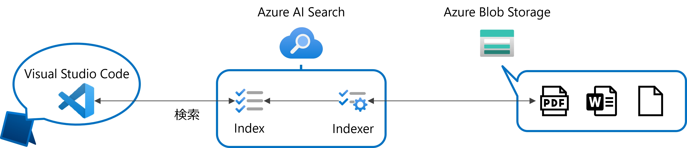

<br />

### Task 1: インデックスの作成

- [Azure Portal](https://portal.azure.com/) から Azure AI Search の **概要** を表示

- **データのインポート** をクリック

  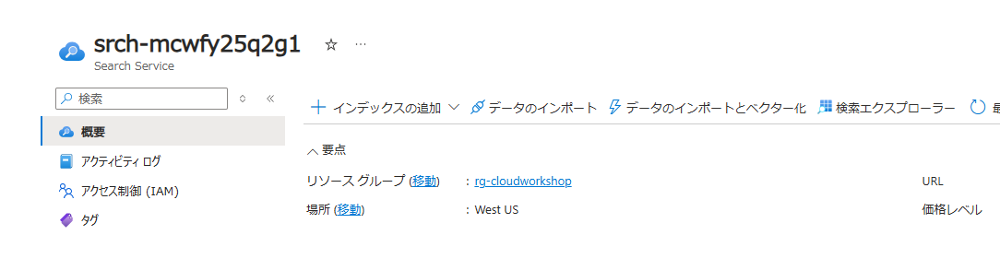

- **データに接続します** タブで必要項目を入力

  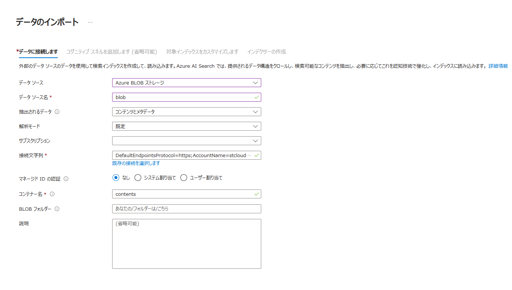

  - **データ ソース**: Azure BLOB ストレージ

  - **データ ソース名**: blob (任意)

  - **抽出されるデータ**: コンテンツとメタデータ

  - **解析モード**: 既定

  - **サブスクリプション**: ワークショップで使用中のサブスクリプション

  - **接続文字列**: **既定の接続を選択します** をクリックし、ドキュメントが格納されている BLOB コンテナを選択

    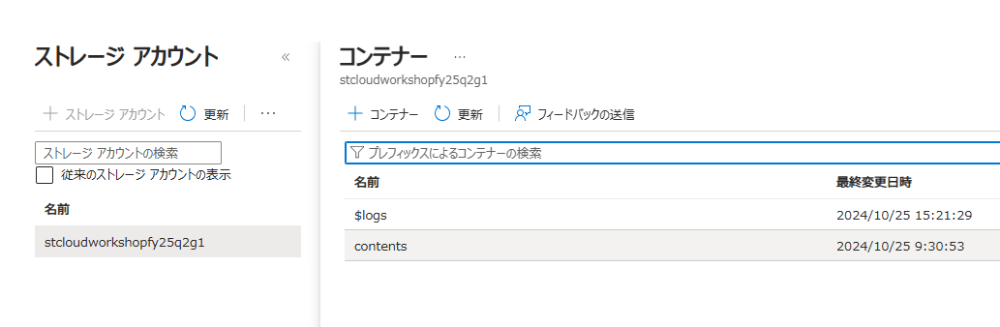

  - **マネージド ID の認証**: なし

  - **コンテナー名**: 接続文字列で選択したコンテナー名が自動入力

  - **説明**: 任意

- **次: コグニティブ スキルを追加します (省略可能)** をクリック

- **コグニティブ スキルを追加します** タブで必要項目を選択

  - **AI サービスをアタッチする** で **無料 (制限付きのエンリッチメント)** が表示されていることを確認

    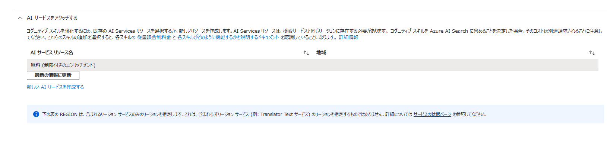

    > 無料リソースは、インデクサーあたり 1 日 20 個のドキュメントまでのエンリッチに制限

  - **エンリッチメントの追加**

    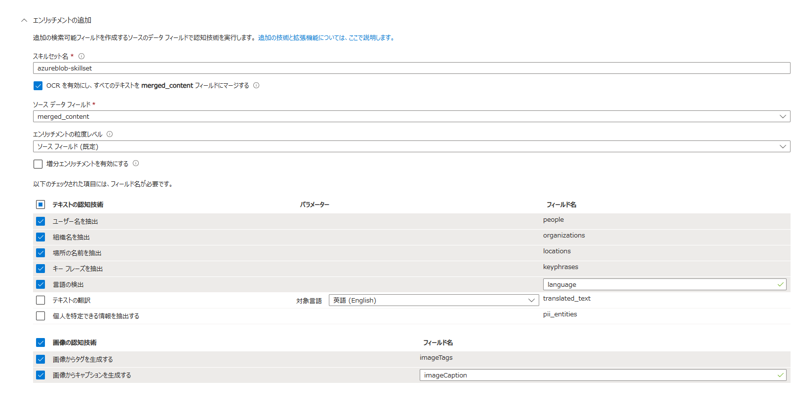

    - **スキルセット名**: azureblob-skillset (任意)

    - **OCR を有効にし、すべてのテキストを merged_content フィールドにマージする**: チェック

    - **ソース データ フィールド**: merged_content

    - **エンリッチメントの粒度レベル**: ソース フィールド (既定)

    - **テキストの認知技術** で以下の項目をチェック (フィールド名は既定のままで OK)

      - **ユーザー名を抽出**

      - **組織名を抽出**

      - **場所の名前を抽出**

      - **キーフレーズを抽出**

      - **言語の検出**

    - **画像の認知技術**

      - **画像からタグを生成する**

      - **画像からキャプションを生成する**

- **次: 対象インデックスをカスタマイズします** をクリック

- **対象インデックスをカスタマイズします** タブでインデックスとして格納するフィールドを設定

  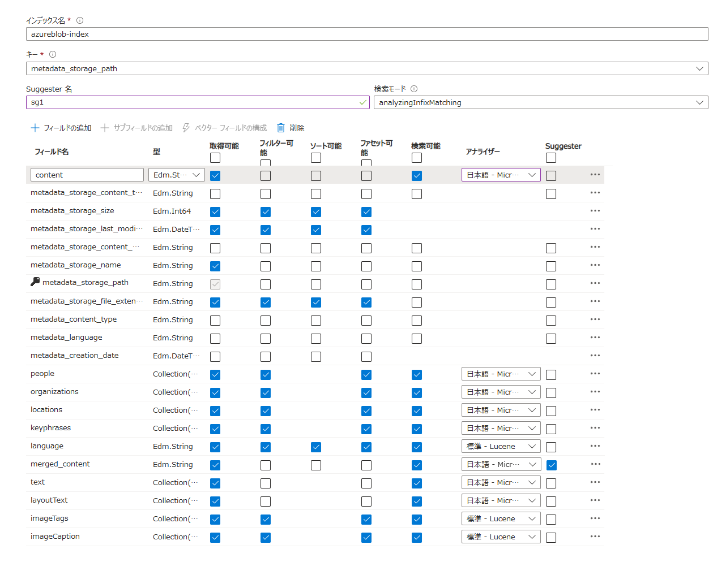

  - **インデックス名**: azureblob-index (任意)

  - **キー**: metadata_storage_path

  - **Suggester 名**: sg1 (任意)

  - **検索モード**: analyzingInfixMatching

    | フィールド名 | 取得<br />可能 | フィルター<br />可能 | ソート<br />可能 | ファセット<br />可能 | 検索<br />可能 | アナライザー | Suggester |
    | --- | :---: | :---: | :---: | :---: | :---: | --- | :---: |
    |content|●||||●|日本語 ‐ Microsoft||
    |metadata_storage_size|●|●|●|●||||
    |metadata_storage_last_modified|●|●|●|●||||
    |metadata_storage_name|●|||||||
    |metadata_storage_file_extension|●|●|●|●||||
    |people|●|●||●|●|日本語 ‐ Microsoft||
    |organizations|●|●||●|●|日本語 ‐ Microsoft||
    |locations|●|●||●|●|日本語 ‐ Microsoft||
    |keyphrases|●|●||●|●|日本語 ‐ Microsoft||
    |language|●|●|●|●|●|標準 ‐ Lucene||
    |merged_content|●||||●|日本語 ‐ Microsoft|●|
    |text|●||||●|日本語 ‐ Microsoft||
    |layoutText|●||||●|日本語 ‐ Microsoft||
    |imageTags|●|●||●|●|標準 ‐ Lucene||
    |imageTags|●|●||●|●|標準 ‐ Lucene||

- **次: インデクサーの作成** をクリック

- **インデクサーの作成** タブで必要項目を指定

  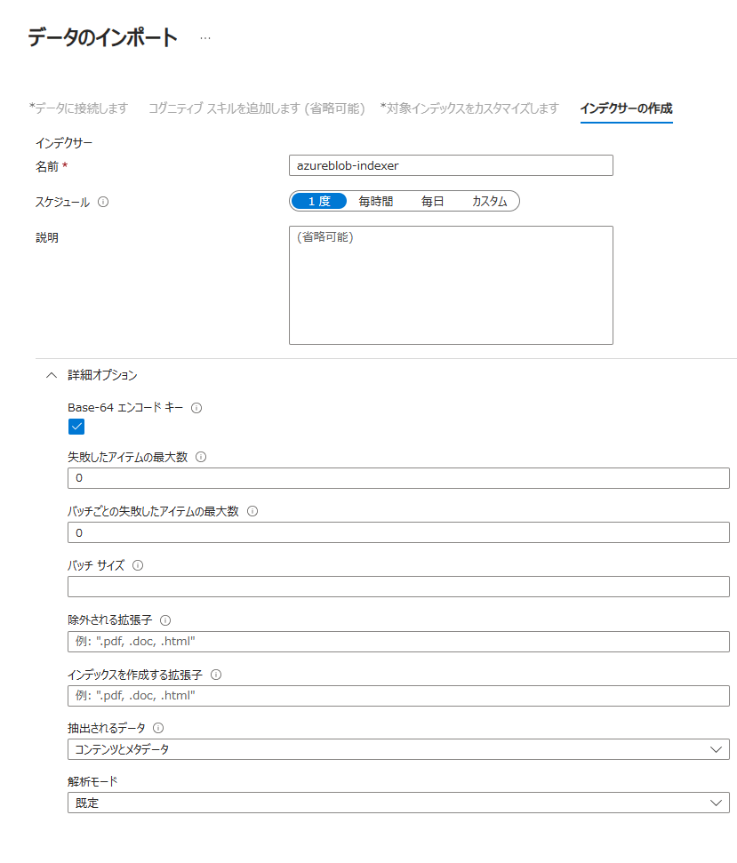

  - **インデクサー**

    - **名前**: azureblob-indexer (任意)

    - **スケジュール**: １度

  - **詳細オプション**

    - **Base-64 エンコード キー**: オン

- **送信** をクリックし、インデクサーを作成

- Azure AI Search の **検索管理** > **インデクサー** を選択

  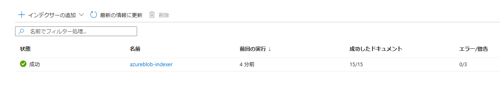

  > ステータスに **成功** と表示されており、インデキシングが完了していることを確認

<br />

### Task 2: インデックス、スキルセットの設定

- **検索管理** > **インデックス** を選択、インデックス名をクリック

- **CORS** タブをクリック

- **許可されたオリジンの種類** で **すべて** を選択し **保存** をクリック

  

  > クライアントの JavaScript から API の呼び出しを許可するために CORS を有効化

- **検索管理** > **スキルセット** を選択、スキルセット名をクリック

  > スキルセット ＝ 各スキルの定義とその実行順を JSON 形式で定義したもの

- OCR スキルの言語、キーフレーズ抽出スキルの上限、エンティティ認識スキルの信頼度スコアの閾値を設定

  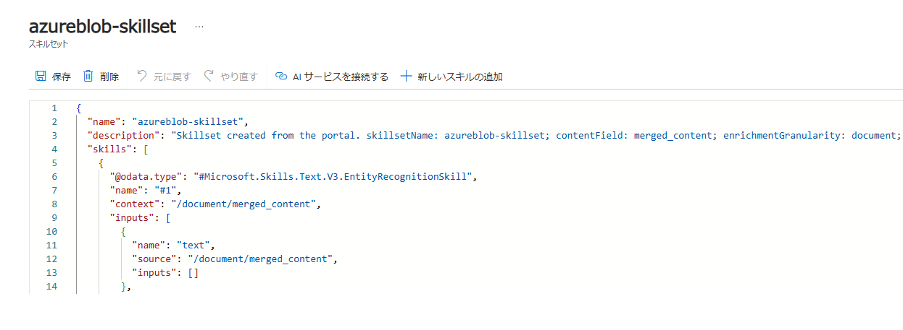

  - OCR スキル (Microsoft.Skills.Vision.OcrSkill) の defaultLanguageCode を en から ja に変更

    ```
    "defaultLanguageCode": "ja"
    ```

  - キーフレーズ抽出 (Microsoft.Skills.Text.KeyPhraseExtractionsSkill) に追加

    ```
    "defaultLanguageCode": "en",
    "maxKeyPhraseCount": 20
    ```

  - エンティティ認識スキル (Microsoft.Skills.Text.V3.EntityRecognitionSkill) に追加

    ```
    "defaultLanguageCode": "en",
    "minimumPercision": 0.8
    ```

- **保存** をクリック

<br />

### Task 3: インデックスの再作成

- **検索管理** > **インデクサー** を選択、インデクサー名をクリック

- **リセット** をクリックし、インデキシングされたデータをクリア

  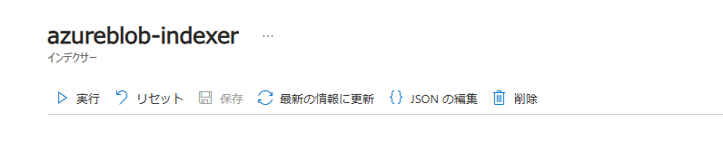

- インデクサーのリセットのメッセージが表示されるので **はい** をクリック

  

- インデクサー ｘｘｘ は正常にリセットされましたの通知を確認し **実行** をクリック

- インデクサーを実行のメッセージが表示されるので **はい** をクリック

  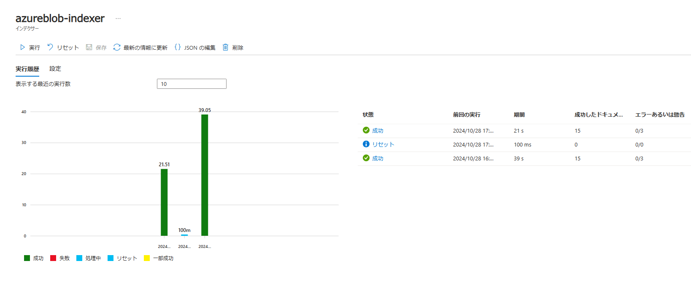

- **最新の情報に更新** をクリックし、インデックスの再作成が正常に完了したことを確認

  

<br />

### Task 4: 検索クエリの発行

> 事前に Visual Studio Code 拡張機能で REST Client のインストールが必要  
> インストールは、拡張機能タブで **REST Client** で検索し、**Install** をクリックして実行
> 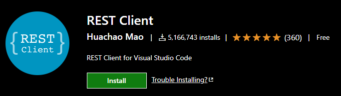  
> 拡張機能の設定で Rest-Client: Decode Escaped Unicode Characters にチェック
> 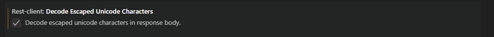  
> ※ Unicode でエンコードされた文字を自動的に対応する文字にデコードする処理の有効化

<br />

- Visual Studio Code の Explorer タブで **test** > **search.http** ファイルを選択

- baseUrl, index-name, api-key を指定

  - **baseUrl**: Azure AI Search の概要画面に表示される Url

  - **index-name**: 前の手順で作成したインデックス名  
  
  - **api-key**: Azure AI Search の **設定** > **キー** で管理されるクエリ キー

- search に検索するテキスト (任意) を指定し、**Ctrl** + **Alt** + **R** キーを押下しリクエストを送信

  > 右クリックで表示されるメニューから **Send Request** を選択でも OK

- 検索結果が表示

<br />

### Task 5: フルテキスト検索

- **search.http** ファイルの search の検索テキストを **画像 認識** に変更し、リクエストを送信

  ```
  "search": "画像 認識"
  ```

  > 検索結果: 8 件  
  > 画像と認識のいずれか一方、または両方が含まれるドキュメントを検索 (OR 検索)  
  > 画像 | 認識 の記述でも可

- 検索テキストを **画像 + 認識** に変更し、再度リクエストを送信

  ```
  "search": "画像 + 認識"
  ```

  > 検索結果: 5 件  
  > 画像と認識の両方が含まれているドキュメントを検索 (AND 検索)

- 特定の用語を除外するよう検索テキストを **画像 -認識** に変更し、リクエストを送信

  ```
  "search": "画像 -認識"
  ```

  > 検索結果: 14 件  
  > 画像を含むドキュメントと認識が含まれないドキュメントを検索 (NOR 検索)

- 検索テキストに指定した条件をすべて満たして検索を行うため searchMode=all を指定し、リクエストを送信

  ```
    "search": "画像 -認識",
    "searchMode": "all",
    "count": true
  ```

  > 検索結果: 2 件  
  > 画像を含み、且つ認識が含まれないドキュメントを検索 (NAND 検索)  
  > 既定は searchMode=any で一部でも条件を満たすものを結果として取得

- Full Lucene 構文を使用するため queryType を full に設定し検索を実行

  ```
    "search": "画像 OR 認識",
    "queryType": "full",
    "count": true
  ```

  > 検索結果: 8 件  
  > 画像と認識のいずれか一方、または両方が含まれるドキュメントを検索 (OR 検索)  
  > クエリ文字列にブール演算子の埋め込みが可、テキスト ブール演算子 (AND, OR, NOT) は大文字で指定

- 単数文字のワイルドカード検索

  ```
    "search": "gpt-?",
    "queryType": "full",
    "count": true
  ```

  > 検索結果: 3 件
  > GPT-3, GPT-4 などを含むドキュメントを検索

- 複数文字のワイルドカード検索

  ```
    "search": "gpt-*",
    "queryType": "full",
    "count": true
  ```

  > 検索結果: 4 件
  > GPT-3, GPT-4 に加え GPT-4o などを含むドキュメントを検索

- 検索テキストの前に **「?」**, **「*」** を使用しての検索

  ```
    "search": "/.?udio/",
    "queryType": "full",
    "count": true
  ```

  ```
    "search": "/.*udio/",
    "queryType": "full",
    "count": true
  ```

  > 正規表現の **/** (スラッシュ) 区切り記号が必要

<br />

### Task 6: 高度な検索

- 検索結果に含めるフィールドを指定して検索

  ```
    "search": ".NET",
    "select": "metadata_storage_name, metadata_storage_size, metadata_storage_last_modified",
    "queryType": "full",
    "count": true
  ```

  > select にカンマ区切りでフィールド名を指定  
  > インデックスで取得可能とマークしたフィールドのみ指定可  
  > 既定では取得可能とマークしたすべてのフィールドを含む結果を取得

- 検索結果をファイル サイズの大きい順にソート

  ```
    "search": ".NET",
    "select": "metadata_storage_name, metadata_storage_size, metadata_storage_last_modified",
    "orderby": "metadata_storage_size desc",
    "queryType": "full",
    "count": true
  ```

  > orderby に並べ替えで使用するフィールドを指定  
  > インデックスでソート可能とマークしたフィールドのみ指定可  
  > 既定では関連性スコアを使用した順位付けで結果を取得

- フィルター構文を使用した検索

  ```
    "search": ".NET",
    "select": "metadata_storage_name, metadata_storage_size, metadata_storage_last_modified",
    "filter": "metadata_storage_file_extension eq '.docx'",
    "queryType": "full",
    "count": true
  ```

  > filter にフィルター処理で使用するフィールドを指定  
  > インデックスでフィルター可能とマークしたフィールドのみ指定可  
  > and, or, not 演算子を使用して複数フィールドを指定可  
  > フィルター処理が先にインデックスに適用され、その結果に対して検索が実行されるためパフォーマンス向上にも有効

<br />

### Task 7: デモ アプリの作成

- [Azure Portal](https://portal.azure.com/) から Azure AI Search の **検索管理** > **インデックス** を選択し、インデックス名をクリック

- **デモ アプリの作成** をクリック

  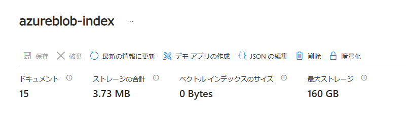

- **次へ** をクリック

  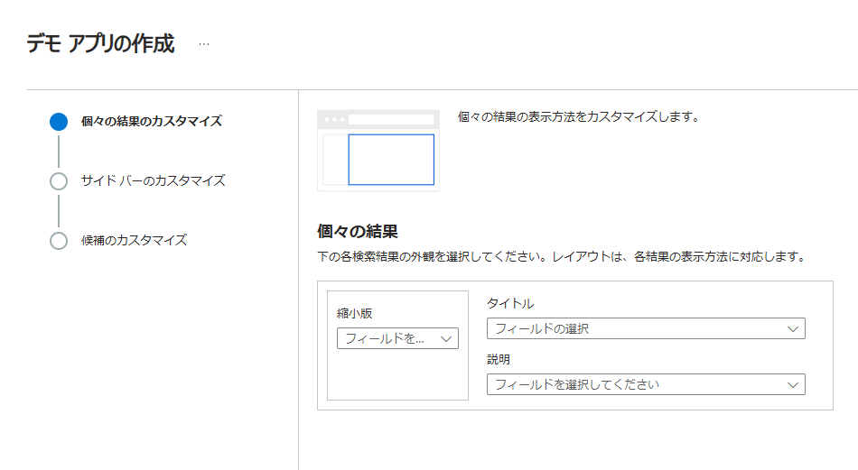

- 検索画面の左側に表示されるフィルター項目を設定

  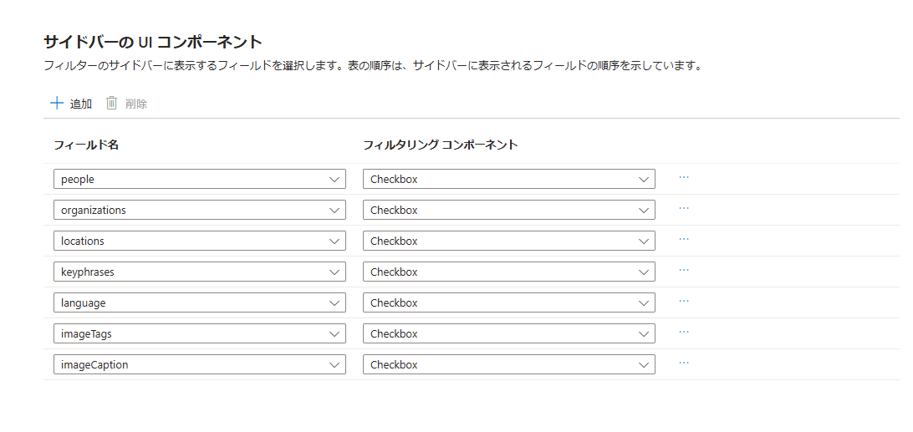

  - **people** - **Checkbox**

  - **organizations** - **Checkbox**

  - **locations** - **Checkbox**

  - **keyphrases** -  **Checkbox**

  - **language** - **Checkbox**

  - **imageTags** - **Checkbox**

  - **imageCaption** - **Checkbox**

- **次へ** をクリック

- 検索ボックスの候補として表示されるフィールドを選択

  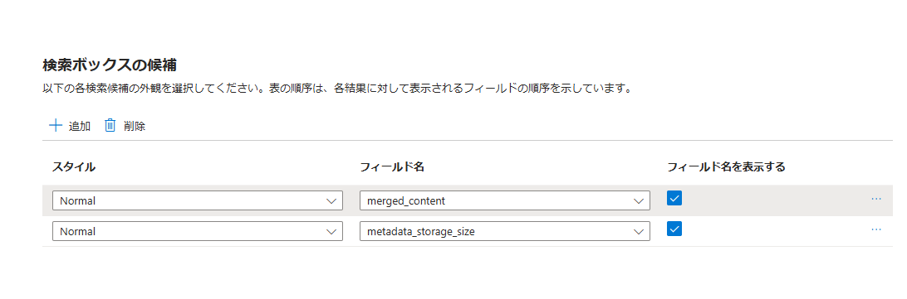

  > インデックス作成時に Suggester の設定を行った merged_content を選択

- **デモ アプリの作成** をクリック

- デモ アプリの準備完了のメッセージが表示されるので **ダウンロード** をクリックし、任意の場所に HTML ファイルを保存

  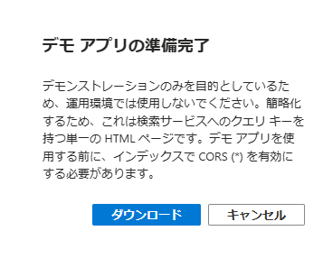

- ダウンロードした HTML ファイルをブラウザで開き、検索を実行

  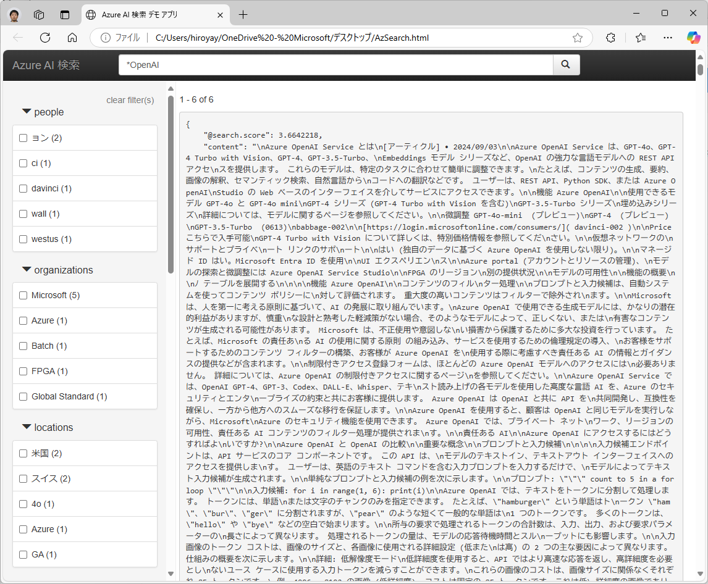

  > HTML ファイル内に接続情報が含まれるため、本番環境での利用は厳禁

<br />

### 参考情報

- [Azure AI Search の概要](https://learn.microsoft.com/ja-jp/azure/search/search-what-is-azure-search)

- [Azure AI Search の機能](https://learn.microsoft.com/ja-jp/azure/search/search-features-list)

- [インデクサーの概要](https://learn.microsoft.com/ja-jp/azure/search/search-indexer-overview)

- [ドキュメント検索 (Azure AI Search REST API)](https://learn.microsoft.com/ja-jp/rest/api/searchservice/search-documents)

- [Simple query syntax in Azure AI Search](https://learn.microsoft.com/ja-jp/azure/search/query-simple-syntax)

- [Lucene query syntax in Azure AI Search](https://learn.microsoft.com/ja-jp/azure/search/query-lucene-syntax)
