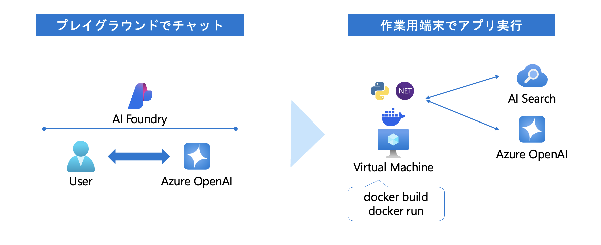
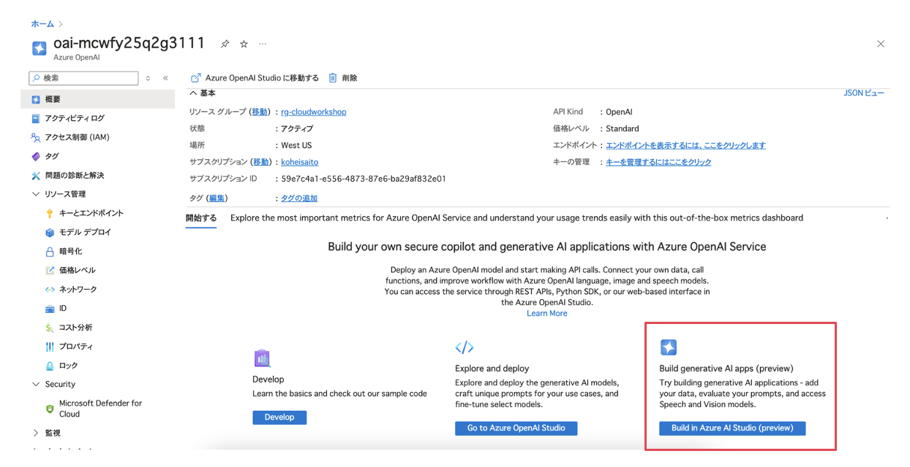
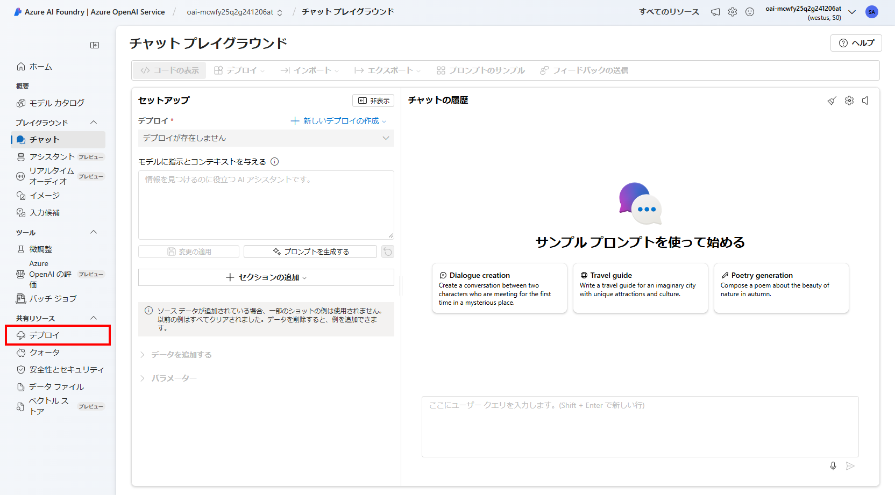
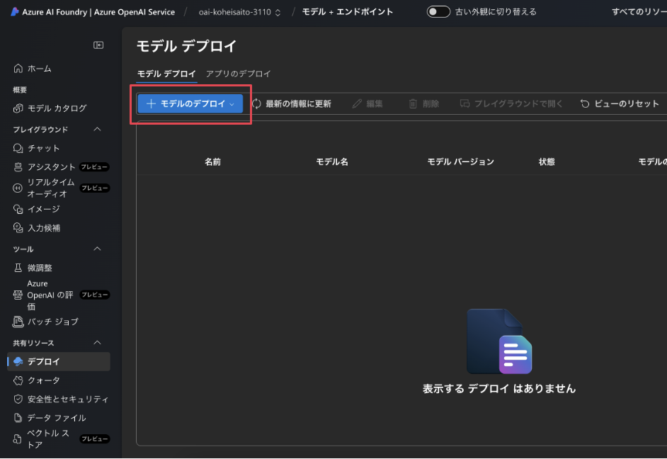
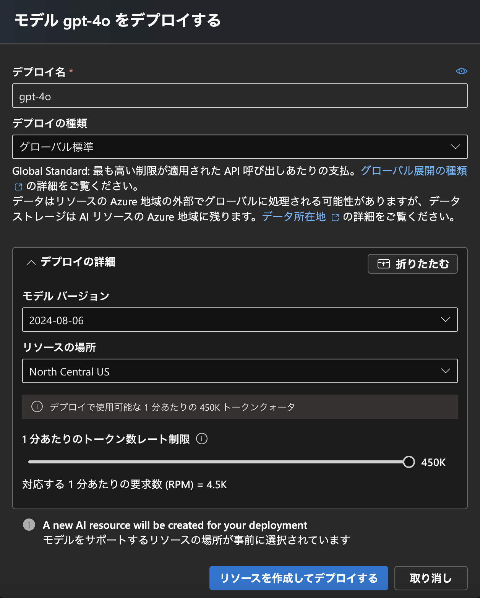
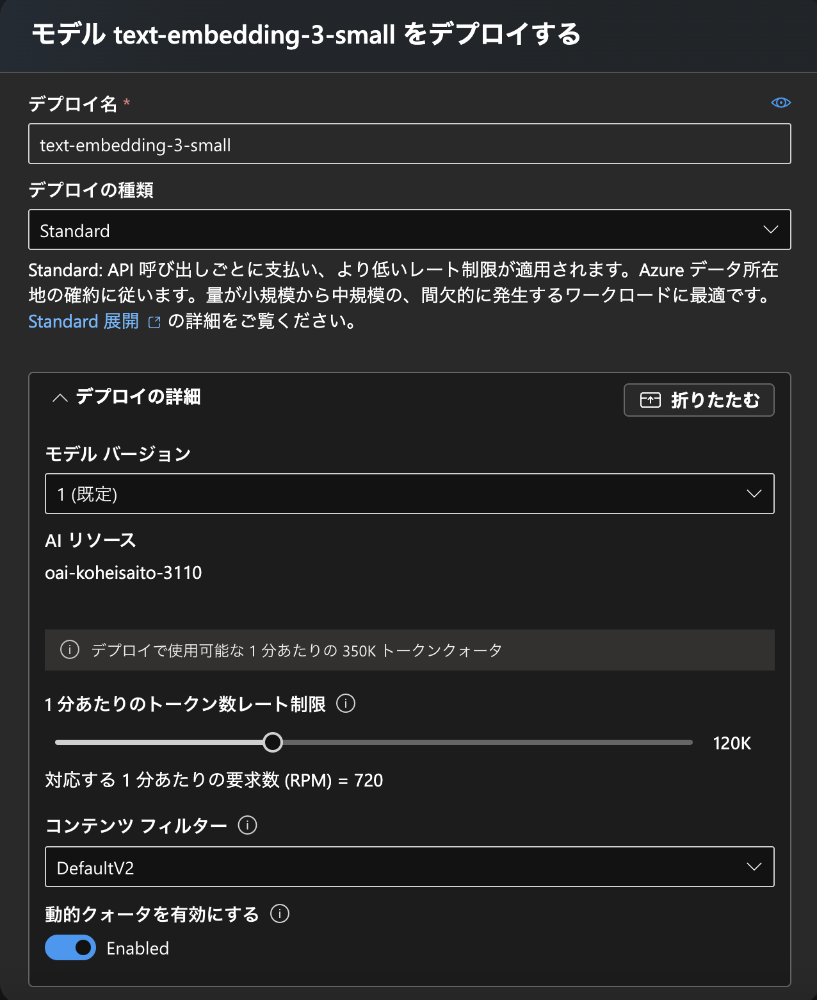
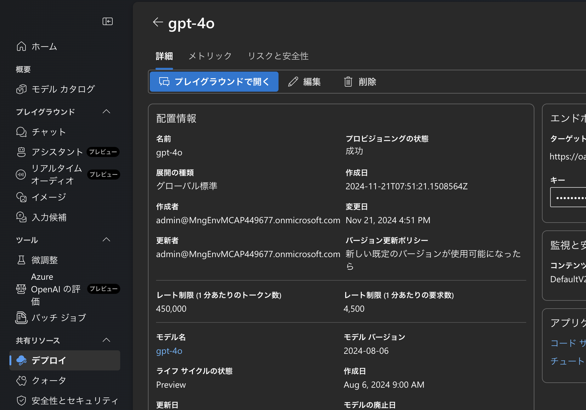
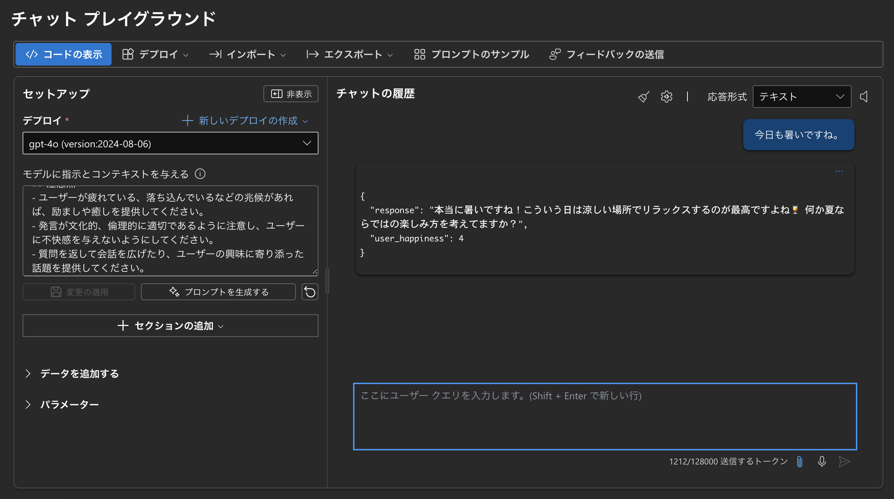
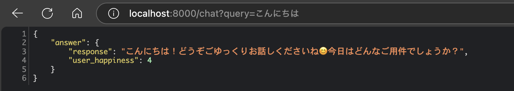
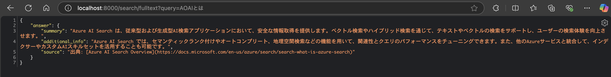

Retrieval Augmented Generation (RAG) pattern for Azure AI Search  
Dec 2024

<br />

### Contents

- [Exercise 2: 生成 AI アプリケーションの動作確認](#exercise-2-生成-AI-アプリケーションの動作確認)

## Exercise 2: 生成 AI アプリケーションの動作確認



<br />

### Task 1: Azure AI Foundry プレイグラウンドを用いた動作確認

- 2 種類のAzure OpenAI モデルを展開

    - 展開済みの Azure OpenAI リソースに移動し、**[Go to Azure AI Studio]** を選択

        

    - **共有リソース** > **デプロイ** を選択

        

    - **デプロイ** > **+ モデルのデプロイ** を開き、 **基本モデルをデプロイする** を選択

        

    - `gpt-4o` をデプロイ

        - デプロイ名: **gpt-4o**
        - デプロイの種類: **グローバル標準**
        - デプロイの詳細:

            - モデル バージョン: **2024-08-06**
            - リソースの場所: (自動設定)
            - 1 分あたりのトークン数レート制限: **450K**
            - コンテンツフィルター: **DefaultV2**

        

    - `text-embedding-3-small` をデプロイ

        - デプロイ名: **text-embedding-3-small**
        - デプロイの種類: **Standard**
        - デプロイの詳細:

            - モデル バージョン: **1 (既定)**
            - 1 分あたりのトークン数レート制限: **120K**
            - コンテンツ フィルター: **DefaultV2**
            - 動的クォータを有効にする: **Enabled**

        

- [モデル デプロイ] から展開済みの **gpt-4o** を選択し、**プレイグラウンドで開く** ボタンを押下



- `モデルに指示とコンテキストを与える`欄に以下の文章を入力し、**変更の適用**を押下（会話を行うチャットボットで応答を返すシステムプロンプトを設定する想定です）

```
あなたの役割は、ユーザーと親しみやすく、リラックスした雰囲気の会話を行うチャットボットとして機能することです。
ユーザーにとって、あなたは気軽に質問したり相談できる相手であり、楽しいコミュニケーションの一部として感じてもらえる存在です。
合わせて、ユーザーのクエリを理解し、満足度を判断して適切な応答を生成することが求められます。
以下の要件を守って応答を生成してください。

## 応答生成のルール
1. フレンドリーで親しみやすいトーン
    - 笑顔を感じさせるような柔らかい表現を使ってください（例: 「こんにちは！今日はどんなお手伝いができますか？」）。
    - 難しい言葉を避け、カジュアルでわかりやすい言葉を選んでください。
2. 共感と励まし
    - ユーザーの気持ちに寄り添い、共感を示してください（例: 「それは大変そうですね！」や「いい質問ですね！」）。
    - ユーザーが前向きになれるような言葉を添えてください（例: 「一緒に解決しましょう！」）。
3. 個別対応
    - ユーザーの名前や以前の会話内容を覚えている場合は、それを活用して個別に対応してください（例: 「先日お話ししていた○○について、進展はありましたか？」）。
4. ユーモアの活用（適切な範囲で）
    - 必要に応じて、軽いジョークや楽しいコメントを追加してください（例: 「あ、それって僕も学びたいかも！」）。
5. ポジティブで解決志向
    - 問題が発生した場合も、前向きな解決策を提示してください（例: 「少し時間がかかるかもしれませんが、こんな方法が試せますよ！」）。

## 応答のフォーマット
{
    "response": "回答",
    "user_happiness": "ユーザーの満足度（1-5。5が一番満足度が高い）"
}

## 応答例
1. ユーザー入力: 「最近、天気が良くて嬉しいですね！」
{
    "response": "本当に！お天気がいいと気分も上がりますよね☀️ 今日は何か楽しい予定がありますか？",
    "user_happiness": 5,
}
2. ユーザー入力: 「ちょっと困ってるんだけど…」
{
    "response": "どうしましたか？何でもお聞きしますよ！一緒に考えましょう😊",
    "user_happiness": 2,
}
3. ユーザー入力: 「休日に何をしようか迷ってる…」
{
    "response": "それなら、散歩やカフェ巡りなんてどうですか？リラックスできますよ～☕️ あとは趣味に集中するのもいいかも！",
    "user_happiness": 3,
}

## 注意点
- ユーザーが疲れている、落ち込んでいるなどの兆候があれば、励ましや癒しを提供してください。
- 発言が文化的、倫理的に適切であるように注意し、ユーザーに不快感を与えないようにしてください。
- 質問を返して会話を広げたり、ユーザーの興味に寄り添った話題を提供してください。
```

- チャット欄から会話をし、応答の JSON が返却されることを確認（例: `今日も暑いですね。`）




### Task 2: 作業用端末での動作確認

<details>
<summary>Python</summary>

- `/app/python/simple/.env` ファイルに環境変数をセット

```.env
AZURE_OPENAI_ENDPOINT=https://your_aoai_service_name.openai.azure.com/  <!--  Azure OpenAI 「キーとエンドポイント」から確認  -->
AZURE_OPENAI_API_KEY=your_aoai_key  <!--  Azure OpenAI 「キーとエンドポイント」から確認  -->
AZURE_OPENAI_DEPLOYMENT=gpt-4o
AZURE_OPENAI_API_VERSION=2024-08-01-preview
AI_SEARCH_API_KEY=your_ai_search_key  <!--  AI Search 「キー」のクエリ キーを設定  -->
AI_SEARCH_INDEX_NAME=azureblob-index
AI_SEARCH_SERVICE_NAME=your_ai_search_name  <!--  例: srch-mcwfy25q2g1  -->
AZURE_KEY_VAULT_NAME=your_key_vault_name  <!--  例: kv-mcwfy25q2g1  -->
```

- 作業用端末にコンテナイメージをビルドし、実行

```shell
cd ./app/python/simple
docker build -t python-simple:0.0.1 .
docker run -p 8000:8000 python-simple:0.0.1
```

- ブラウザからチャット API をコールし、レスポンスを取得することを確認

> GET /chat?query={input} で、上記手順で試した会話を行うチャットボットとの対話を実施可能。APIは実装済み。

```
http://localhost:8000/chat?query=こんにちは
```



- ブラウザから検索 API をコール

> GET /search/fulltext?query={input} で、input をクエリとする全文検索を実施可能。APIは実装済み。

```
http://localhost:8000/search/fulltext?query=AOAIとは
```



</details>

<details>
<summary>C#</summary>

- `app/csharp/simple/.env` ファイルに環境変数をセット

```.env
AZURE_OPENAI_ENDPOINT=https://your_aoai_service_name.openai.azure.com/  <!--  Azure OpenAI 「キーとエンドポイント」から確認  -->
AZURE_OPENAI_API_KEY=your_aoai_key  <!--  Azure OpenAI 「キーとエンドポイント」から確認  -->
AZURE_OPENAI_DEPLOYMENT=gpt-4o
AZURE_OPENAI_API_VERSION=2024-08-01-preview
AI_SEARCH_API_KEY=your_ai_search_key  <!--  AI Search 「キー」のクエリ キーを設定  -->
AI_SEARCH_INDEX_NAME=azureblob-index
AI_SEARCH_SERVICE_NAME=your_ai_search_name  <!--  例: srch-mcwfy25q2g1  -->
```

- 作業用端末にコンテナイメージをビルドし、実行

```shell
cd app/csharp/simple
docker build -t csharp-simple:0.0.1 .
docker run -p 8080:8080 csharp-simple:0.0.1
```

- ブラウザからチャット API をコールし、レスポンスを取得することを確認

> GET /chat?query={input} で、上記手順で試した会話を行うチャットボットとの対話を実施可能。APIは実装済み。

```
http://localhost:8080/chat?query=こんにちは
```


- ブラウザから検索 API をコール

> GET /search/fulltext?query={input} で、input をクエリとする全文検索を実施可能。APIは実装済み。

```
http://localhost:8080/search/fulltext?query=AOAIとは
```


</details>