Retrieval Augmented Generation (RAG) pattern for Azure AI Search  
Dec 2024

<br />

### Contents

- [Exercise 3: プライベート リンクを経由する送信接続の構成](#exercise-3-プライベート-リンクを経由する送信接続の構成)

- [Exercise 4: ベクトル インデックスの作成](#exercise-4-ベクトル-インデックスの作成)

  - [Task 1: マネージド ID の作成](#task-1-マネージド-id-の作成)

  - [Task 2: ロールの割り当て](#task-2-ロールの割り当て)

  - [Task 3: ベクトル インデックスの作成](#task-3-ベクトル-インデックスの作成)

  - [Task 4: ベクトル検索](#task-4-ベクトル検索)

<br />

## Exercise 3: プライベート リンクを経由する送信接続の構成

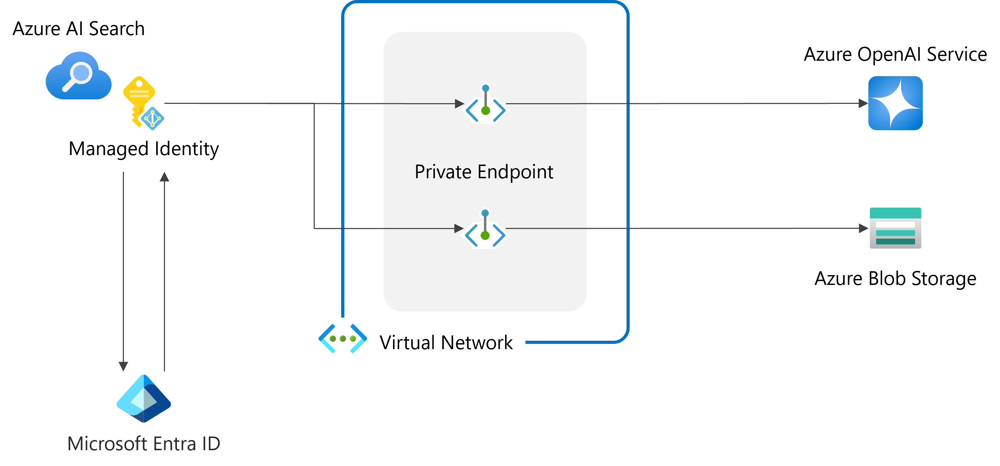

<br />

### 共有プライベート リンクの作成

> 共有プライベート リンク = 特定の Azure AI Search によって内部的に使用される特定の Azure リソースへのプライベート接続

- [Azure Portal](https://portal.azure.com/) から Azure AI Search の **設定** > **ネットワーク** を選択

- **共有プライベート アクセス** > **＋ 共有プライベート リンクを追加する** をクリック

  

- 新しい共有プライベート リンクの作成

  - **接続方法**: マイ ディレクトリ内の Azure リソースに接続します

  - **名前**: 任意 (pep-ストレージ アカウント名 など)

  - **サブスクリプション**: ワークショップで使用中のサブスクリプション

  - **リソースの種類**: Microsoft.Storage/storageAccounts

  - **リソース**: ドキュメントが格納されているストレージ アカウント

  - **ターゲット サブリソース**: blob

  - **要求メッセージ**: 任意 (Private Link service from AI Search など)

    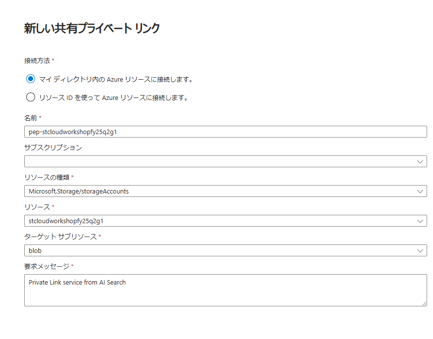

- **作成** をクリック

- **プロビジョニング** が **更新中** から **成功** に変わり、リソースが正常に作成されたことを確認

  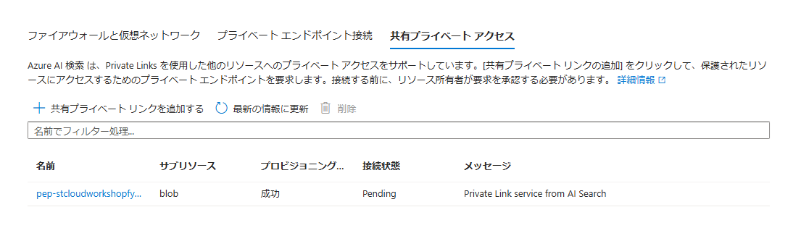

- 再度 **＋ 共有プライベート リンクを追加する** をクリック

- 同様の手順で Azure OpenAI Service への共有プライベート リンクを作成

  - **接続方法**: マイ ディレクトリ内の Azure リソースに接続します

  - **名前**: 任意 (pep-Azure OpenAI Service名 など)

  - **サブスクリプション**: ワークショップで使用中のサブスクリプション

  - **リソースの種類**: Microsoft.CognitiveServices/accounts

  - **リソース**: Azure OpenAI Service 名

  - **ターゲット サブリソース**: openai_account

  - **要求メッセージ**: 任意 (Private Link service from AI Search など)

    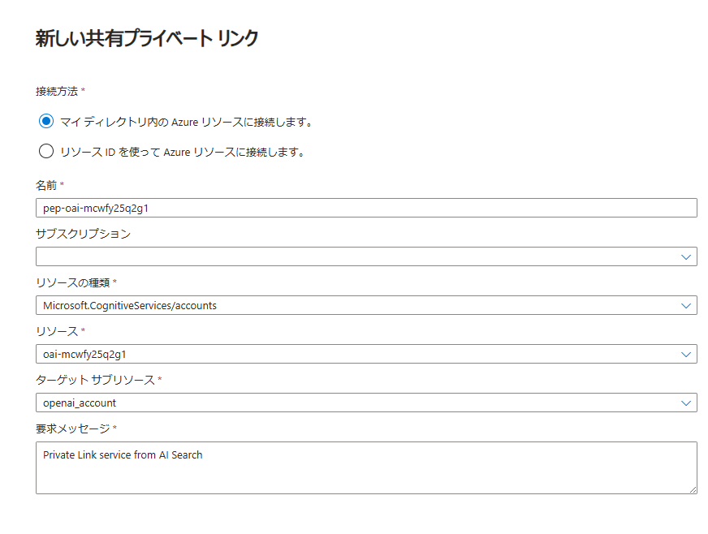

- **作成** をクリック

- **プロビジョニング** が **更新中** から **成功** に変わり、リソースが正常に作成されたことを確認

- ストレージ アカウントの **セキュリティとネットワーク** > **ネットワーク** を選択

- **プライベート エンドポイント接続** タブを選択

- 接続状態が **保留中** のプライベート エンドポイントを選択し **承認** をクリック

  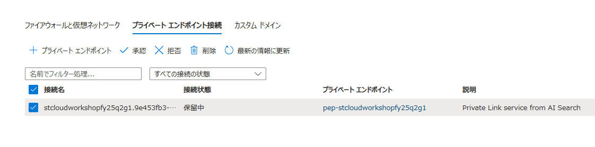

- 確認のメッセージが表示されるので **はい** をクリック

  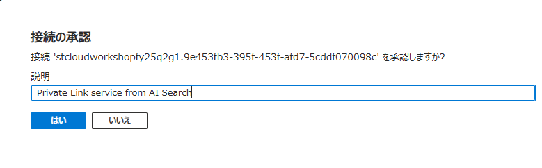

- 接続状態が **承認済み** に変更されることを確認

  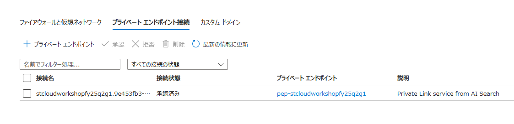

- Azure OpenAI Service の管 **リソース管理** > **ネットワーク** を選択

- 同様の手順でプライベート エンドポイントを承認 

<br />

### 参考情報

- [共有プライベート リンク経由で接続する](https://learn.microsoft.com/ja-jp/azure/search/search-indexer-howto-access-private?tabs=portal-create)

<br />

## Exercise 4: ベクトル インデックスの作成

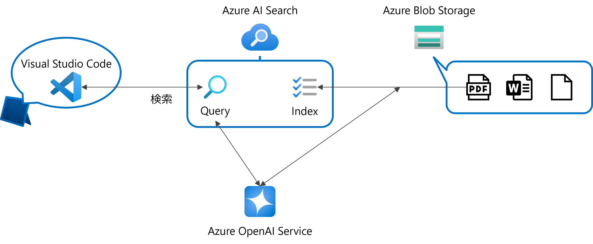

<br />

### Task 1: マネージド ID の作成

- Azure AI Search の **設定** > **ID** を選択

- **システム割り当て済み** タブで **状態** を **オン** に変更し **保存** をクリック

  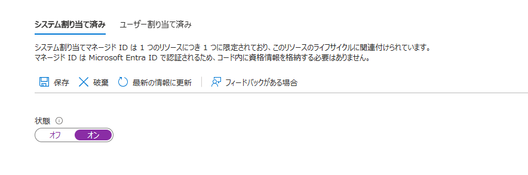

- 確認のメッセージが表示されるので **はい** をクリック

- システム割り当てマネージド ID の有効化が完了

  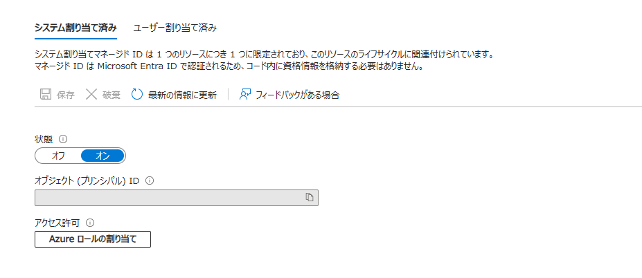

<br />

### Task 2: ロールの割り当て

- ストレージ アカウントの **アクセス制御 (IAM)** を選択

- **追加** > **ロールの割り当ての追加** をクリック

  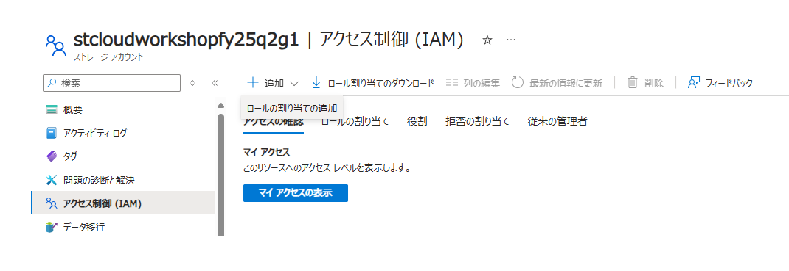

- ロールの割り当ての追加
  
  - **職務ロール** で **ストレージ BLOB データ閲覧者** を選択し **次へ** をクリック

    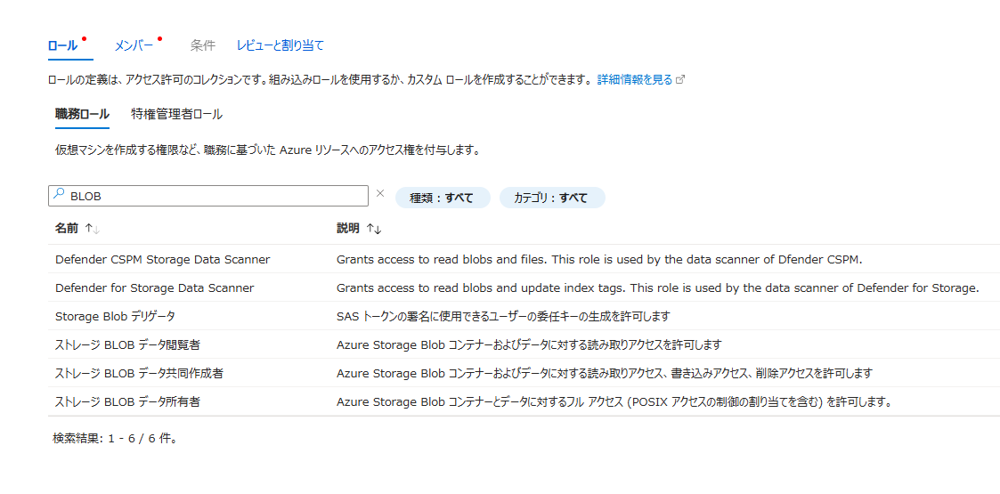

  - **アクセスの割り当て先** で **マネージド ID** を選択し **＋ メンバーを選択する** をクリック

    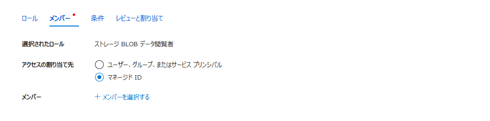
    
  - **マネージドID の選択** でサブスクリプション、マネージド ID (Search Service) を選択

  - Azure AI Search のシステム割り当てマネージド ID をクリックし **選択** をクリック

    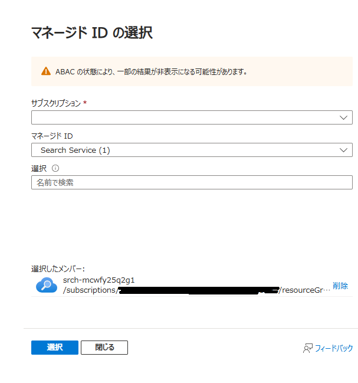
    
  - メンバーに選択したマネージド ID が表示されることを確認し **次へ** をクリック

    

  - **レビューと割り当て** をクリック

    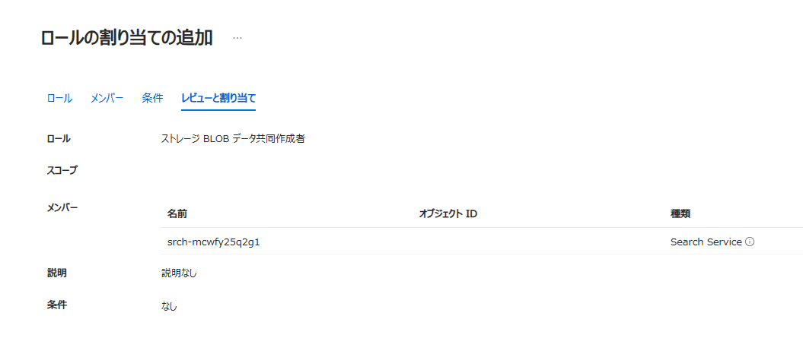

- **アクセス制御 (IAM)** > **ロールの割り当て** タブで適切にロールが割り当てられていることを確認

- Azure OpenAI Service の **アクセス制御 (IAM)** を選択

- 上記と同じ手順で Azure AI Search のマネージド ID に **Cognitive Services OpenAI User** ロールを割り当て

  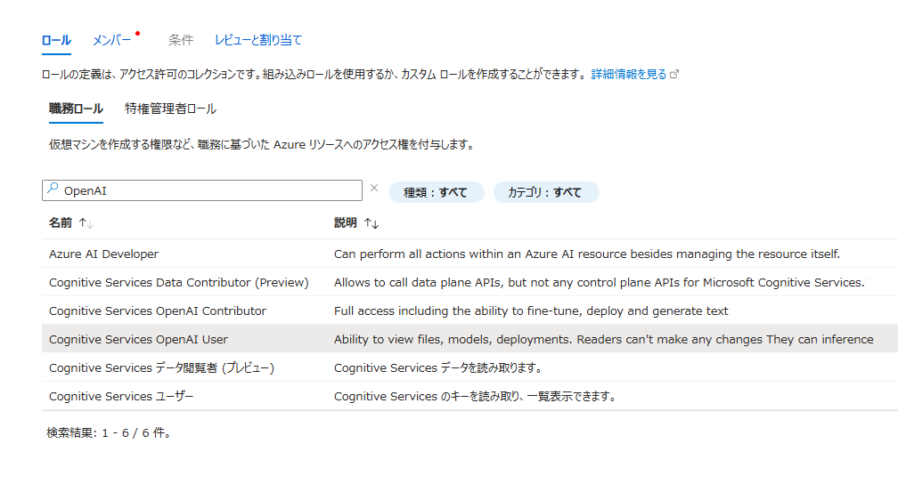

- **アクセス制御 (IAM)** > **ロールの割り当て** タブで適切にロールが割り当てられていることを確認

<br />

### Task 3: ベクトル インデックスの作成

- Azure AI Search の **概要** から **データのインポートとベクター化** をクリック

  

- データのインポートとベクター化

  - **データへの接続**

    - **Azure Blob Storage** をクリック

      
    
    - **Azure Blob Storage の構成**

      - **サブスクリプション**: ワークショップで使用中のサブスクリプション

      - **ストレージ アカウント**: ドキュメントを格納しているストレージ アカウント

      - **BLOB コンテナー**: contents

      - **マネージド ID を使用して認証する**: オン

      - **マネージド ID の種類**: システム割り当て

        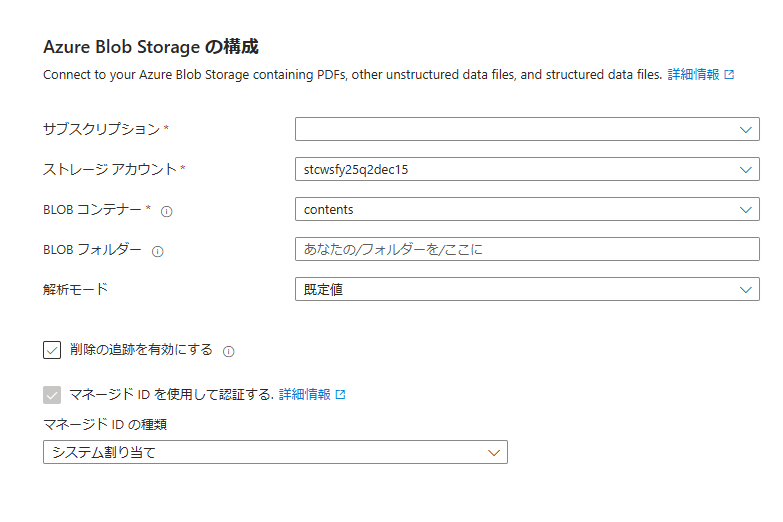
    
  - **テキストをベクトル化する**

    - **Kind**: Azure OpenAI

    - **サブスクリプション**: ワークショップで使用中のサブスクリプション

    - **Azure OpenAI Service**: Embeddings モデルをデプロイした Azure OpenAi Service

    - **モデル デプロイ**: 展開済みのモデル名

    - **認証の種類**: システム割り当て ID

    - **Azure OpenAI サービスに接続すると、アカウントに追加料金が発生することを承認します**: チェック

      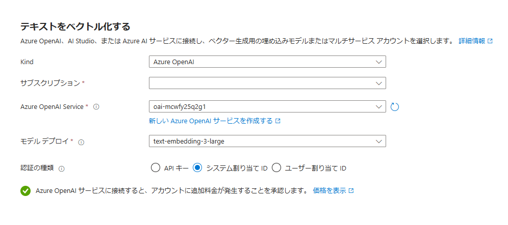
    
  - **画像をベクター化してエンリッチする**

    - **画像のベクトル化**: オフ

    - **画像からテクストを抽出する**: オフ

      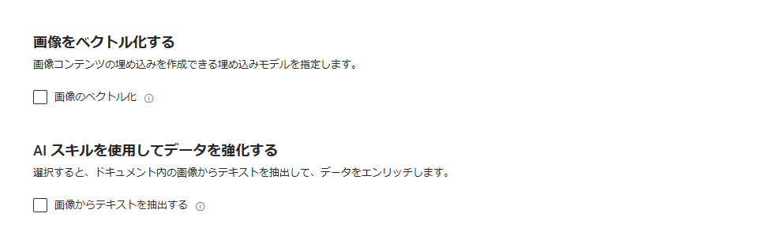

  - **詳細設定**

    - **セマンティック ランカーを有効にする**: オン

    - **スケジュール**: 一度だけ

      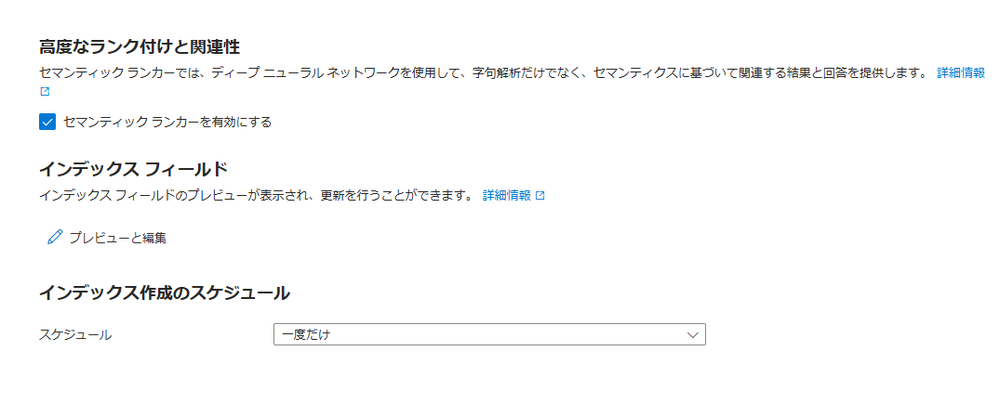

      > **インデックス フィールド** > **プレビューと編集** から必要に応じてフィードを追加可能

      - **既定のフィールド**

        |フィールド|適用対象|説明|
        |---|---|---|
        |chunk_id|テキストと画像ベクトル|インデックスのドキュメント キー<br />検索可能、取得可能、並べ替え可能|
        |parent_id|テキスト ベクトル|チャンクの作成元である親ドキュメント<br />取得可能、フィルター可能|
        |chunk|テキストと画像ベクトル|人が判読できるデータ チャンク<br />検索可能、取得可能|
        |title|テキストと画像ベクトル|人が判読できるドキュメントまたはページ タイトル、ページ番号<br />検索可能、取得可能|
        |text_vector|テキスト ベクトル|チャンクのベクトル表現<br />検索可能、取得可能|
    
  - **レビューと作成**

    - **オブジェクト名のプレフィックス**: 自動生成 (変更も可)

      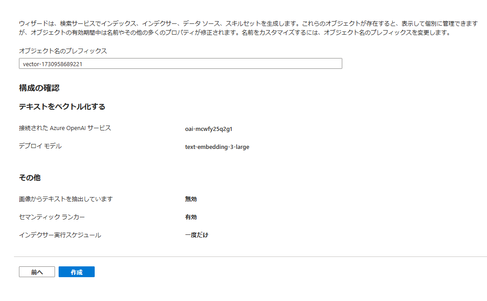

- **作成** をクリックして、データソース、インデックス、スキルセット、インデクサーの作成を開始

- **作成に成功しました** のメッセージが表示、**検索の開始** をクリックし、インデックスを表示

  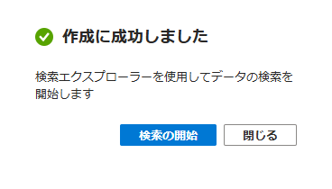

- **CORS** を選択、**許可されたオリジンの種類** で **すべて** を選択し **保存** をクリック

  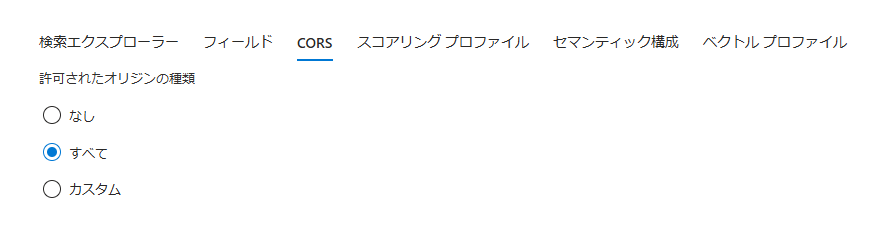

- **JSON の編集** をクリック

  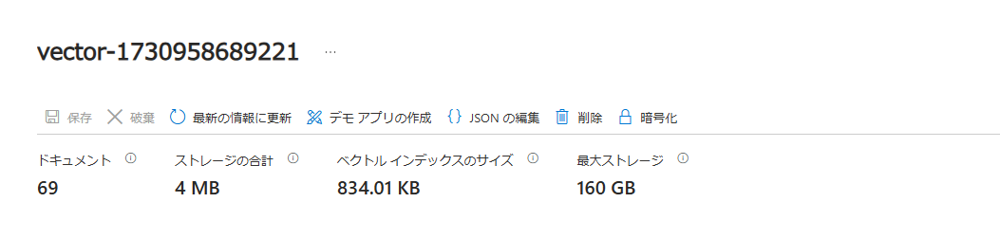

- 検索インデックスにベクトライザーの定義があることを確認

  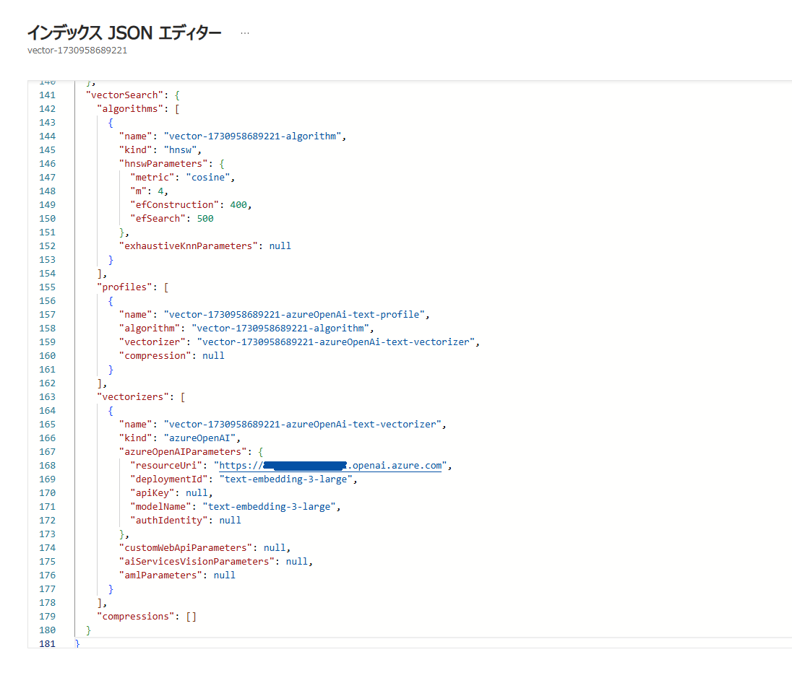

  > ベクトライザー:  
  > 検索可能なベクトル フィールドに適用  
  > クエリの実行時にテキスト (または画像) をベクトルに変換

<br />

### Task 4: ベクトル検索

- Visual Studio Code の Explorer で **test** > **vectorsearch.http** ファイルを選択

- baseUrl, index-name, api-key を指定

  - **baseUrl**: Azure AI Search の概要画面に表示される Url

  - **index-name**: 前の手順で作成したインデックス名  
  
  - **api-key**: Azure AI Search の **設定** > **キー** で管理されるクエリ キー

- 検索テキストを指定し、リクエストを送信

  - ベクトル クエリの構造

    ```
      "count": true,
      "select": "title, chunk",
      "vectorQueries": [
        {
          "kind": "text",
          "text": "Azure OpenAI の保護",
          "fields": "text_vector",
          "k": 3,
          "exhaustive": true
        }
      ]  
    ```

    > vectorQueries: ベクトル検索のコンストラクト  
    > kind: ベクトライザーを定義している場合は text に設定  
    > text: 検索文字列  
    > fields: 検索対象のベクトル フィールド  
    > k (省略可能): 返される最近傍の数  
    > exhaustive (省略可能): 完全な KNN モードを使用

- 応答の確認

  > 検索スコアと select に指定したフィールド一覧が表示  
  > ベクトル探索アルゴリズムによって決定されたスコアで並べ替えられた k 個の結果が検出

  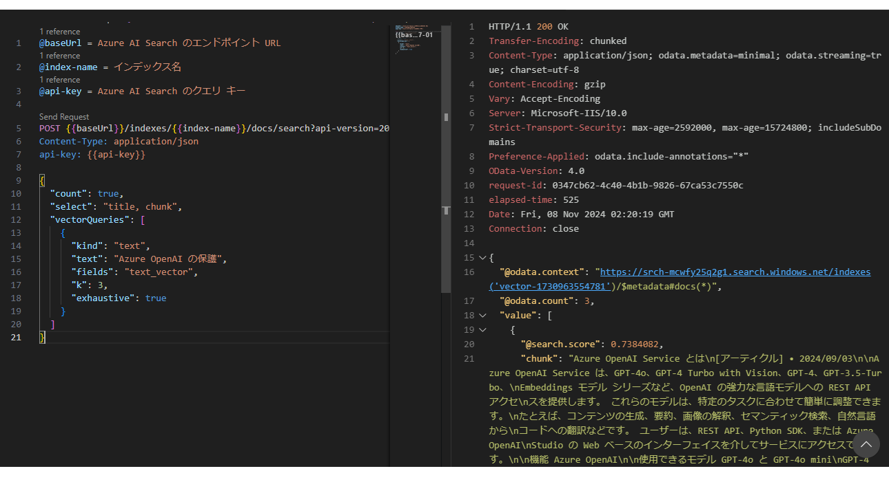

<br />

### 参考情報

- [Azure AI Search 内の統合データのチャンキングと埋め込み](https://learn.microsoft.com/ja-jp/azure/search/vector-search-integrated-vectorization)

- [検索インデックスにベクトル化を構成する](https://learn.microsoft.com/ja-jp/azure/search/vector-search-how-to-configure-vectorizer)

- [Azure portal を使用してテキストと画像をベクトル化する](https://learn.microsoft.com/ja-jp/azure/search/search-get-started-portal-import-vectors?tabs=sample-data-storage%2Cmodel-aoai%2Cconnect-data-storage)

- [Azure OpenAI vectorizer](https://learn.microsoft.com/ja-jp/azure/search/vector-search-vectorizer-azure-open-ai)

- [Azure OpenAI Embedding スキル](https://learn.microsoft.com/ja-jp/azure/search/cognitive-search-skill-azure-openai-embedding)

- [Azure AI Search でのセマンティック ランク付け](https://learn.microsoft.com/ja-jp/azure/search/semantic-search-overview)

- [ベクトル検索での関連性](https://learn.microsoft.com/ja-jp/azure/search/vector-search-ranking)
