Retrieval Augmented Generation (RAG) pattern for Azure AI Search  
Dec 2024

<br />

### Contents

- [Exercise 5: GitHub Actions から Azure への接続](#exercise-5-github-actions-から-azure-への接続)

  - [Task 1: Microsoft Entra ID へのアプリケーションの登録](#task-1-microsoft-entra-id-へのアプリケーションの登録)

  - [Task 2: フェデレーション資格情報の追加](#task-2-フェデレーション資格情報の追加)

  - [Task 3: ロールの割り当て](#task-3-ロールの割り当て)

  - [Task 4: GitHub シークレットの作成](#task-4-github-シークレットの作成)

  - [Task 5: OpenID Connect 認証を使用した Azure へのログイン](#task-5-openid-connect-認証を使用した-azure-へのログイン)

- [Exercise 6: GitHub Actions を用いた Azure リソースの展開](#exercise-6-github-actions-を用いた-azure-リソースの展開)

  - [Task 1: Bicep デプロイ用のパラメーター ファイルの作成](#task-1-bicep-デプロイ用のパラメーター-ファイルの作成)

  - [Task 2: ワークフローの実行](#task-2-ワークフローの実行)

  - [Task 3: Kay Vault へのアクセス権の付与](#task-3-kay-vault-へのアクセス権の付与)

- [Exercise 7: GitHub Actions を用いた API の展開](#exercise-7-github-actions-を用いた-api-の展開)

  - [Task 1: マネージド ID の作成](#task-1-マネージド-id-の作成)

  - [Task 2: ロールの割り当て](#task-2-ロールの割り当て)

  - [Task 3: コンテナー イメージのビルド、プッシュ](#task-3-コンテナー-イメージのビルドプッシュ)

  - [Task 4: Azure Container Apps へのイメージの展開](#task-4-azure-container-apps-へのイメージの展開)

  - [Task 5: シークレットの登録](#task-5-シークレットの登録)

  - [Task 6: API の動作確認](#task-6-api-の動作確認)

<br />

## Exercise 5: GitHub Actions から Azure への接続

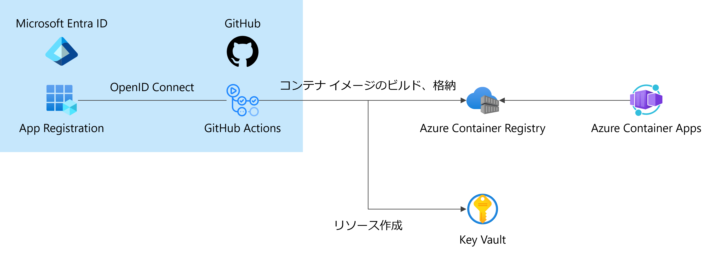

<br />

### Task 1: Microsoft Entra ID へのアプリケーションの登録

- [Azure Portal](https://portal.azure.com/) から Microsoft Entra ID の **アプリの登録** を選択

- **＋ 新規登録** をクリック

  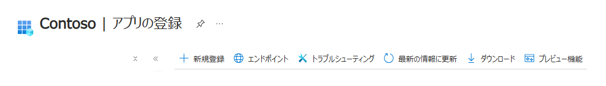

- **アプリケーションの登録** で **名前**、**サポートされているアカウントの種類** を指定

  - **名前**: GitHubActions (任意)

  - **サポートされているアカウントの種類**: この組織ディレクトリのみに含まれるアカウント

    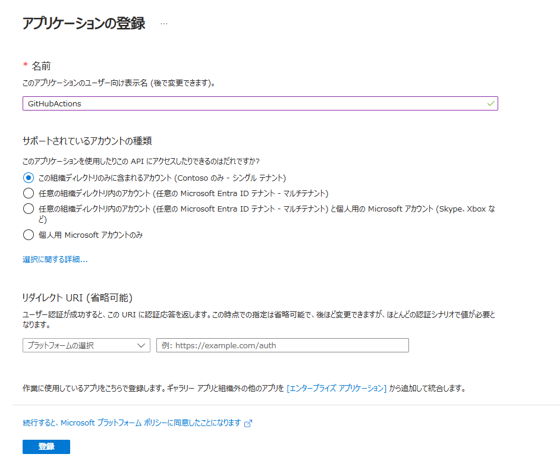

- **登録** をクリックし、アプリケーションを登録

<br />

### Task 2: フェデレーション資格情報の追加

- **証明書とシークレット** を選択、**フェデレーション資格情報** > **＋ 資格情報の追加** をクリック

  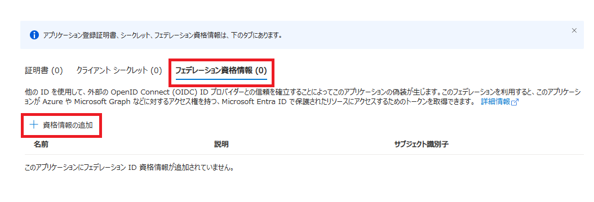

- **資格情報の追加**

  - **フェデレーション資格情報のシナリオ** で **Azure リソースをデプロイする GitHub Actions** を選択

    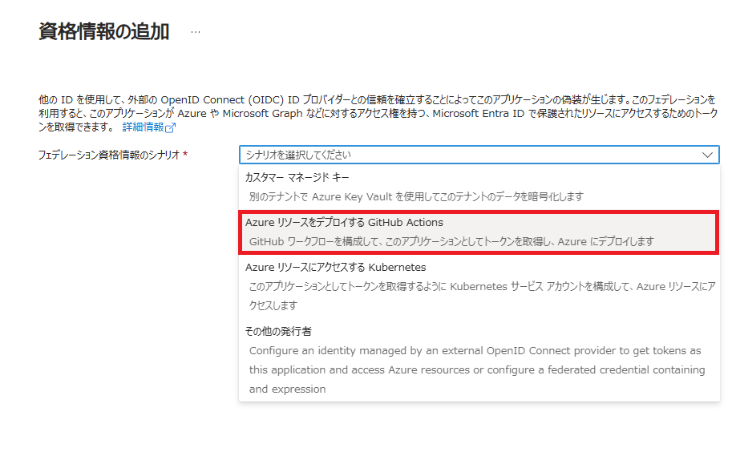

  - 接続先の GitHub アカウント、資格情報の詳細を入力

    - **GitHub アカウントを接続する**

      - **組織**: GitHub アカウント

      - **リポジトリ**: RAG-on-Azure-Hands-on-Lab

      - **エンティティ型**: ブランチ

      - **サブジェクト識別子**: main

    - **資格情報の詳細**

      - **名前**: 任意

        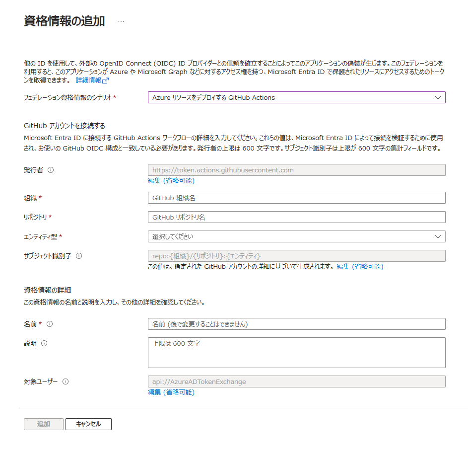

- **追加** をクリックして、資格情報を生成

  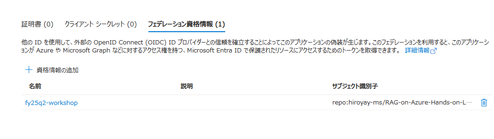

<br />

### Task 3: ロールの割り当て

- リソース グループの **アクセス制御 (IAM)** を選択し、**追加** > **ロール割り当ての追加** をクリック

  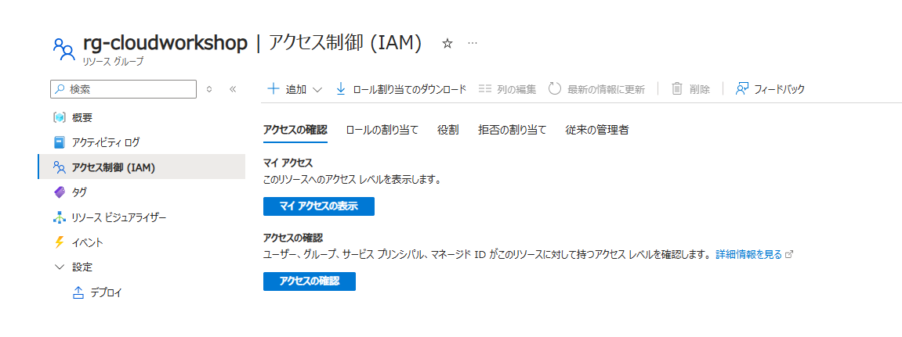

- **特権管理者ロール** > **共同作成者** を選択

  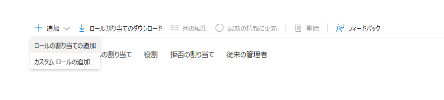

- **アクセスの割当先** で **ユーザー、グループ、またはサービス プリンシパル** を選択、**＋ メンバーを選択する** をクリック

  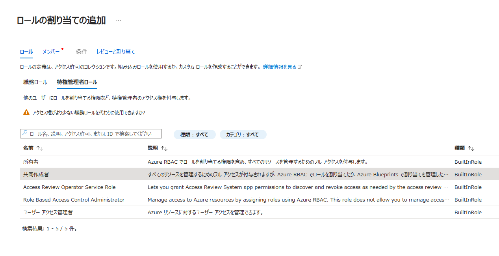

- 登録したアプリケーション名を入力

- 検出されたサービス プリンシパルを選択し **選択** をクリック

  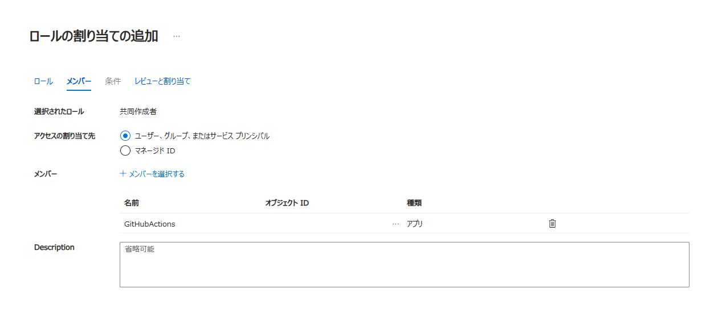

- **レビューと割り当て** をクリックし、ロールを割り当て

  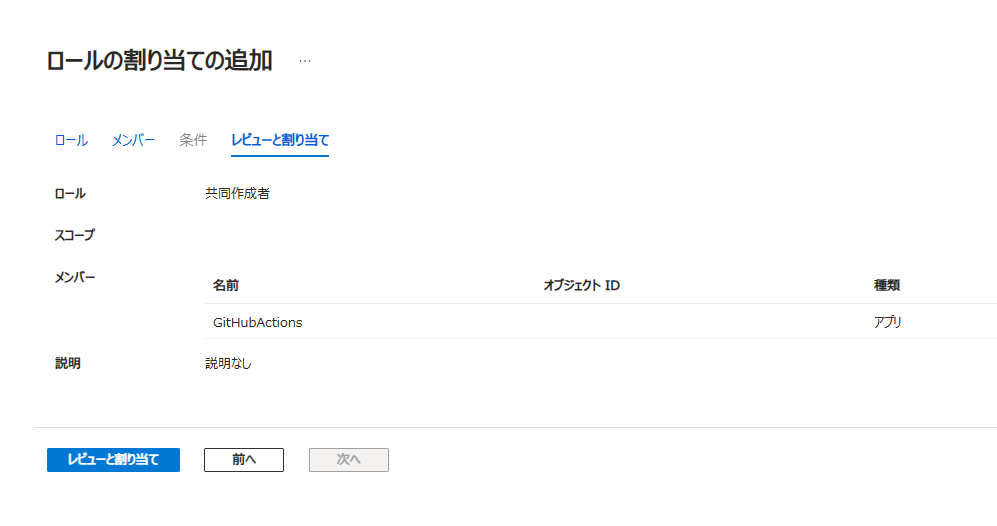

<br />

### Task 4: GitHub シークレットの作成

- Web ブラウザで GitHub アカウントのリポジトリを表示

- **Settings** をクリック

  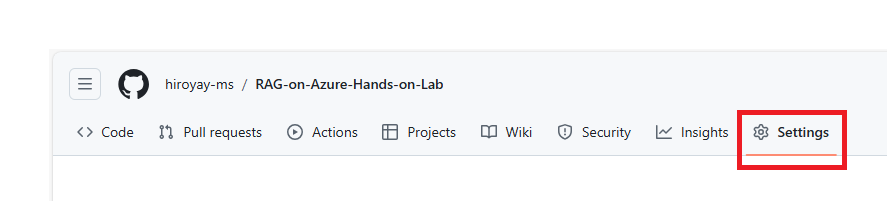

- **Secrets and variables** > **Actions** を選択、**New repository secret** をクリック

  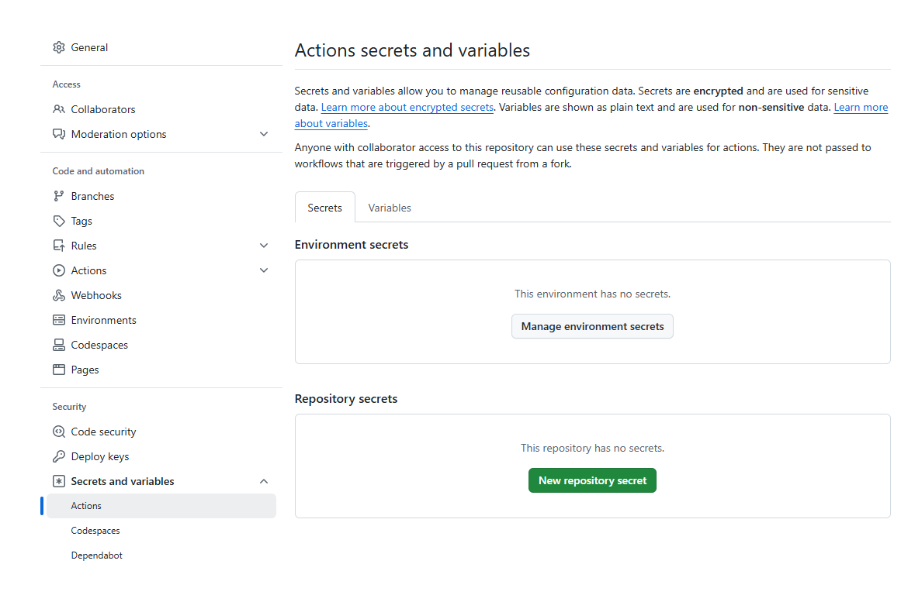

- **Name**, **Secret** を入力し **Add secret** をクリック

  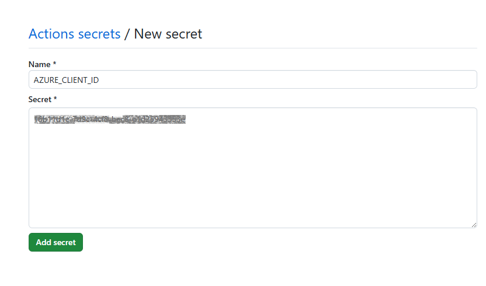

  - 登録するシークレット

    |Name|Secret|
    |---|---|
    |AZURE_CLIENT_ID|アプリケーション (クライアント) ID|
    |AZURE_TENANT_ID|ディレクトリ (テナント) ID|
    |AZURE_SUBSCRIPTION_ID|サブスクリプション ID|

  - アプリケーション (クライアント) ID, ディレクトリ (テナント) ID は、登録したアプリケーションの概要から取得

    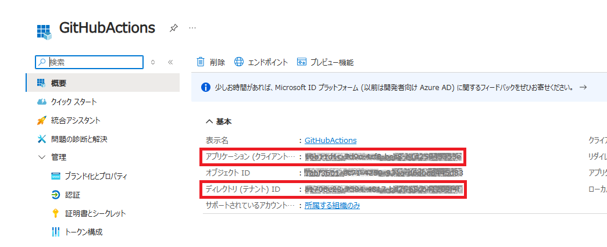

  - サブスクリプション ID は、サブスクリプションの概要から取得

    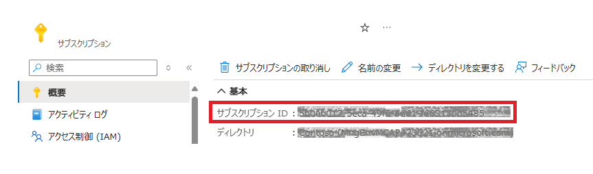

<br />

### Task 5: OpenID Connect 認証を使用した Azure ログイン アクションの使用

- Visual Studio Code の Explorer から **.github** > **workflows** 内のワークフロー ファイルを選択

- Azure ログイン アクションの確認

  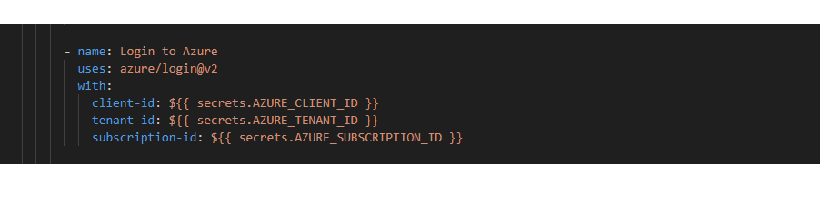

  > GitHub Actions と Microsoft Entra ID 間でフェデレーション ID を用いた信頼関係を設定  
  > OpenID Connect の認証でシークレットを使わないセキュアな構成が可

<br />

### 参考情報

- [GitHub Actions を使用して Azure に接続する](https://learn.microsoft.com/ja-jp/azure/developer/github/connect-from-azure?tabs=azure-portal%2Cwindows)

<br />

## Exercise 6: GitHub Actions を用いた Azure リソースの展開

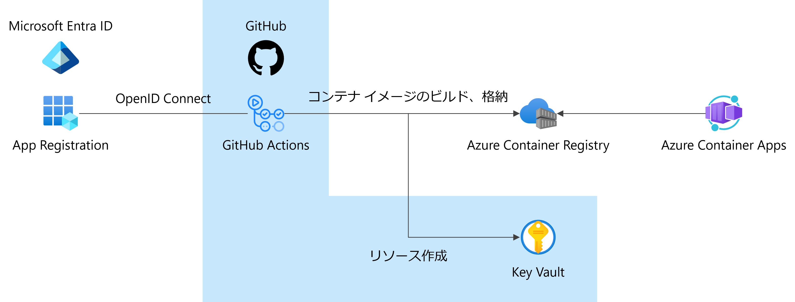

<br />

### Task 1: Bicep デプロイ用のパラメーター ファイルの作成

- Web ブラウザで GitHub アカウントのリポジトリを表示

- **Code** の **bicep** > **parameters** > **keyvault.bicepparam** を選択

- **Edit this file** をクリック

  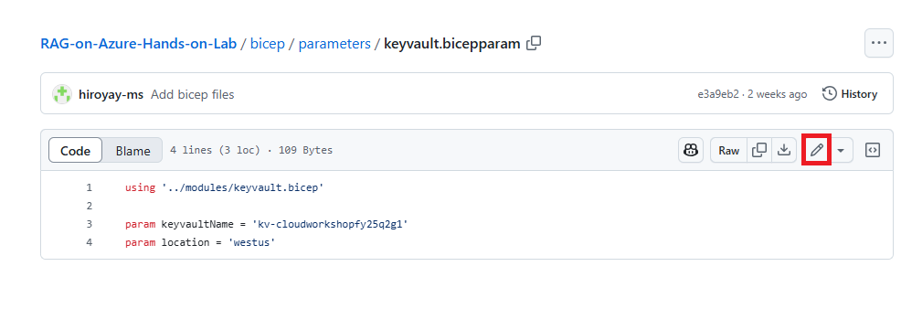

- **keyvaultName**, **location** を指定、**Confirm changes...** をクリックし変更を確定

  - **keyvaultName**: Key Vault リソース名

  - **location**: 展開先の Azure リージョン

    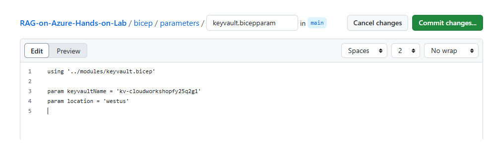

<br />

### Task 2: ワークフローの実行

- **Actions** を選択, **All workflows** > **Deploy Key Vault** を選択

  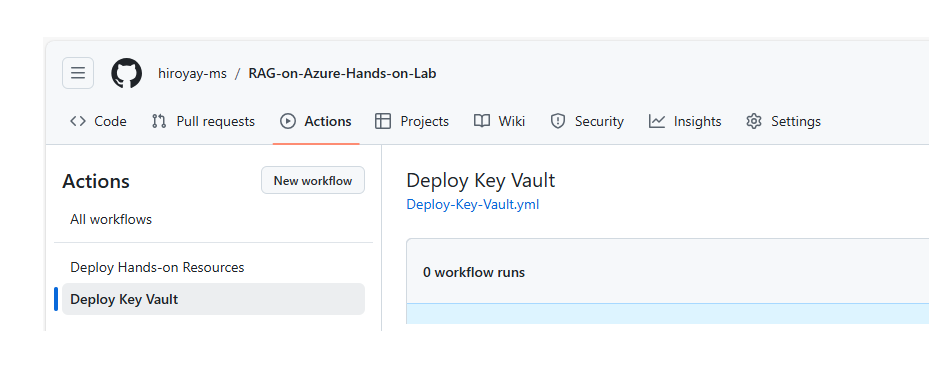

- **Run workflow** をクリック、展開先のリソース グループ名を入力し **Run workflow** をクリック

  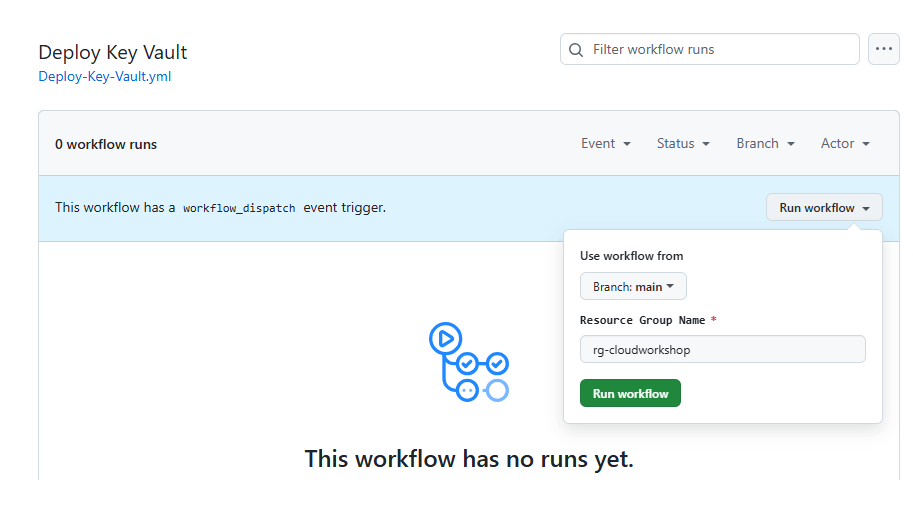

- 進行中のワークフロー (**Deploy Key Vault**) をクリックし、実行の概要を表示

  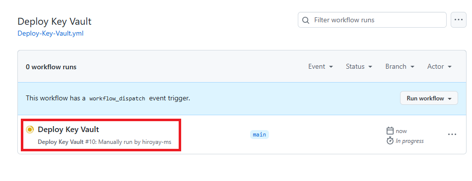

- ジョブ (**deploy-key-vault**) をクリック

  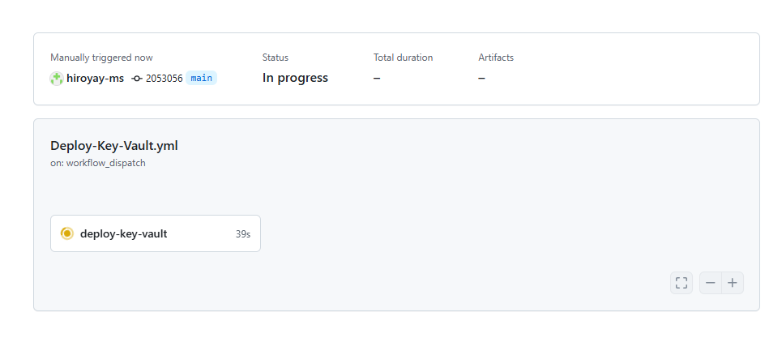

- ステップを展開し、結果を確認

  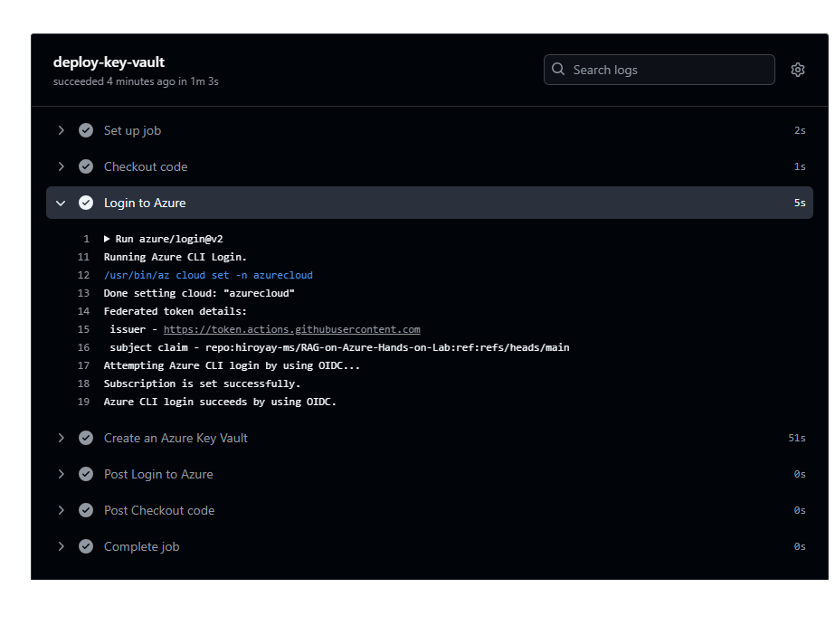

- 作成した Key Vault のリソース名を環境変数にセット

  <details>
  <summary>Python</summary>

  - `./app/python/simple/.env` の `AZURE_KEY_VAULT_NAME` に、Key Vault のリソース名をセット（例: **kv-cwsfy25q2g1**）

  ```
  AZURE_OPENAI_ENDPOINT=https://your_aoai_service_name.openai.azure.com/
  AZURE_OPENAI_API_KEY=your_aoai_key
  AZURE_OPENAI_DEPLOYMENT=gpt-4o
  AZURE_OPENAI_API_VERSION=2024-08-01-preview
  AI_SEARCH_API_KEY=your_ai_search_key
  AI_SEARCH_INDEX_NAME=azureblob-index
  AI_SEARCH_SERVICE_NAME=your_ai_search_name
  AZURE_KEY_VAULT_NAME=your_key_vault_name  # ← 例: kv-cwsfy25q2g1に置き換える
  ```
  </details>

  <details>
  <summary>C#</summary>

  - `./app/csharp/simple/.env` の `AZURE_KEY_VAULT_NAME` に、Key Vault のリソース名をセット（例: **kv-cwsfy25q2g1**）

  ```
  AZURE_OPENAI_ENDPOINT=https://your_aoai_service_name.openai.azure.com/
  AZURE_OPENAI_API_KEY=your_aoai_key
  AZURE_OPENAI_DEPLOYMENT=gpt-4o
  AZURE_OPENAI_API_VERSION=2024-08-01-preview
  AI_SEARCH_API_KEY=your_ai_search_key
  AI_SEARCH_INDEX_NAME=azureblob-index
  AI_SEARCH_SERVICE_NAME=your_ai_search_name
  AZURE_KEY_VAULT_NAME=your_key_vault_name  // ← 例: kv-cwsfy25q2g1に置き換える
  ```
  </details>

<br />

### Task 3: Kay Vault へのアクセス権の付与

- [Azure Portal](https://portal.azure.com/) から Key Vault の **アクセス制御 (IAM)** を選択

- **追加** > **ロールの割り当ての追加** をクリック

- **職務ロール** > **キー コンテナー管理者** を選択

  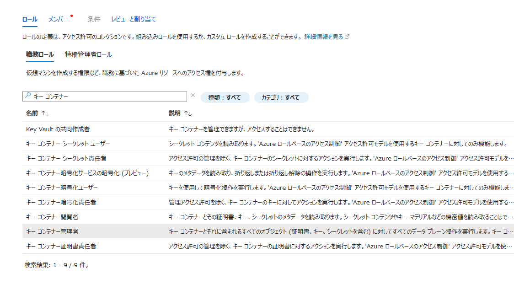

- **アクセスの割当先** で **ユーザー、グループ、またはサービス プリンシパル** を選択、**＋ メンバーを選択する** をクリック

- ポータルにサインイン中のアカウントを指定し **選択** をクリック

- **レビューと割り当て** をクリックし、ロールを割り当て

<br />

### 参考情報

- [Azure 向けの GitHub Actions とは](https://learn.microsoft.com/ja-jp/azure/developer/github/github-actions)

- [GitHub Actions を使用した Bicep ファイルのデプロイ](https://learn.microsoft.com/ja-jp/azure/azure-resource-manager/bicep/deploy-github-actions?tabs=CLI%2Cuserlevel)

- [Key Vault のキー、証明書、シークレットへのアクセス権を付与する](https://learn.microsoft.com/ja-jp/azure/key-vault/general/rbac-guide?tabs=azure-cli)

- [Azure Key Vault セキュリティ](https://learn.microsoft.com/ja-jp/azure/key-vault/general/security-features)

<br />

## Exercise 7: GitHub Actions を用いた API の展開

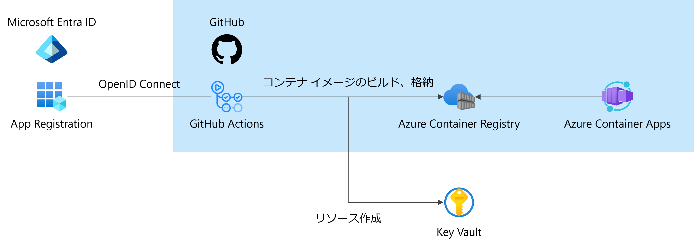

<br />

### Task 1: マネージド ID の作成

- Azure Container Apps の **設定** > **ID** を選択

- **システム割り当て済み** タブで **状態** を **オン** に変更し **保存** をクリック

  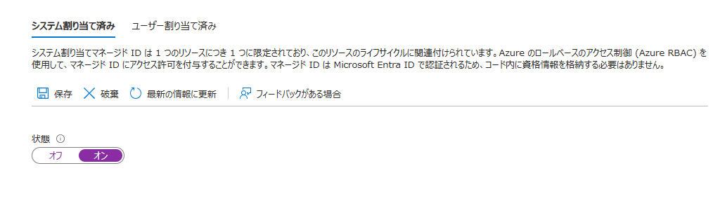

- 確認のメッセージが表示されるので **はい** をクリック

- システム割り当てマネージド ID の有効化が完了

  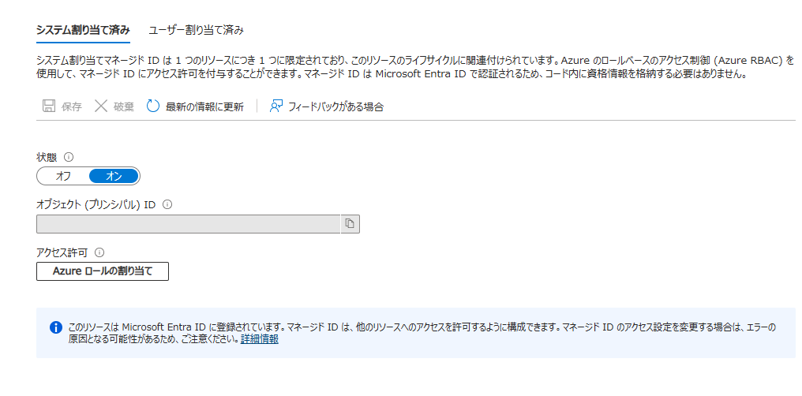

<br />

### Task 2: ロールの割り当て

- Key Vault の **アクセス制御 (IAM)** を選択

- **追加** > **ロールの割り当ての追加** をクリック

- **職務ロール** で **キー コンテナー シークレット ユーザー** を選択し **次へ** をクリック

  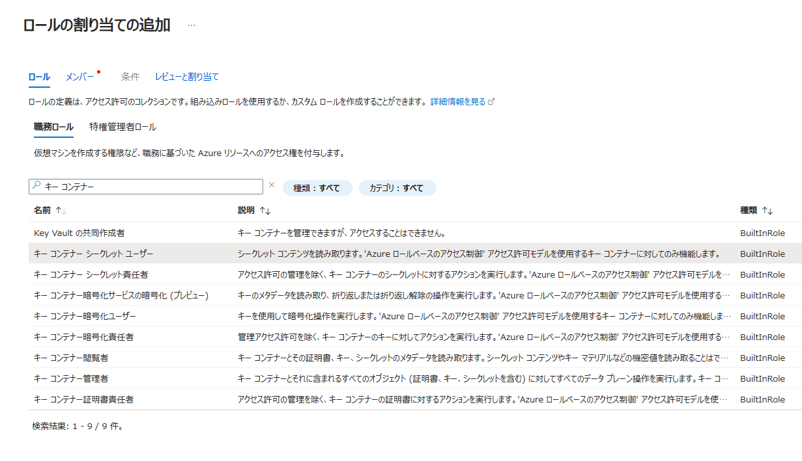

- **アクセスの割り当て先** で **マネージド ID** を選択し **＋ メンバーを選択する** をクリック

- **マネージドID の選択** でサブスクリプション、マネージド ID (コンテナー アプリ) を選択

- Container Apps のシステム割り当てマネージド ID をクリックし **選択** をクリック

  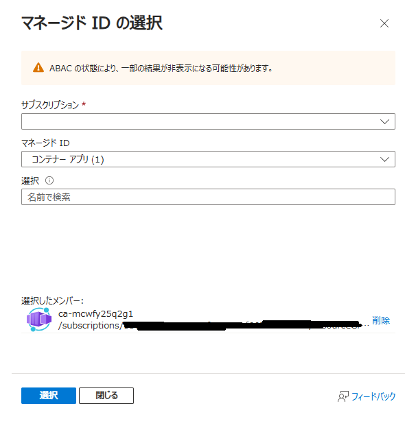

- メンバーに選択したマネージド ID が表示されることを確認し **次へ** をクリック

- **レビューと割り当て** をクリックし、ロールを割り当て

<br />

### Task 3: シークレットの登録

- 以下のシークレットを Key Vault に登録

  - **ai-search-api-key**: `AI Search の API キー`
  - **azure-openai-api-key**: `Azure OpenAI の API キー`

  > シークレット名に使用できるのは、英数字とダッシュのみです。

### Task 4: コンテナー イメージのビルド、プッシュ

<details>
<summary>Python</summary>

- Key Vault を使うようにコードを書き換え

  - `./app/python/simple/service/helpers/helper_methods.py` のコメントアウトを以下のように修正

    ```python
    # return "dummy_secret"　　# ビルドエラーを回避するため、ダミーの値を返す
    key_vault_name = os.getenv("AZURE_KEY_VAULT_NAME")
    key_vault_uri = f"https://{key_vault_name}.vault.azure.net"
    credential = DefaultAzureCredential()
    client = SecretClient(vault_url=key_vault_uri, credential=credential)
    secret = client.get_secret(secret_name)
    return secret.value
    ```

  - `./app/python/simple/service/ai_search_service.py` の 26 行目を以下のように修正

    ```python
      get_secret_from_key_vault("ai-search-api-key")  # 元々は os.environ.get("AI_SEARCH_API_KEY")
    ```

  - `./app/python/simple/service/aoai_service.py` の 14 行目を以下のように修正

    ```python
      get_secret_from_key_vault("azure-openai-api-key")  # 元々は os.environ.get("AZURE_OPENAI_API_KEY")
    ```

- リモートリポジトリに push

  > ハンズオンのため、`main` ブランチに直接 push します。


- GitHub Actions (`Deploy-Container-Image.yml`) を手動実行

  - language に `python` を選択

</details>

<details>
<summary>C#</summary>

- Key Vault を使うようにコードを書き換え

  - `./app/csharp/simple/Services/Helpers/HelperMethods.cs` のコメントアウトを以下のように修正

    ```csharp
      // return "DUMMY_SECRET";  // ビルドエラーを回避するため、ダミーの値を返す
      string keyVaultName = Environment.GetEnvironmentVariable("AZURE_KEY_VAULT_NAME");
      string keyVaultUri = $"https://{keyVaultName}.vault.azure.net";
      var credential = new DefaultAzureCredential();
      var client = new SecretClient(new Uri(keyVaultUri), credential);
      KeyVaultSecret secret = client.GetSecret(secretName);
      return secret.Value;
    ```

  - `./app/csharp/simple/Services/AiSearchService.cs` の 26 行目を以下のように修正

    ```csharp
      var apiKey = HelperMethods.GetSecretFromKeyVault("ai-search-api-key");  /// 元々は Environment.GetEnvironmentVariable("AI_SEARCH_API_KEY");
    ```

  - `./app/csharp/simple/Services/AoaiService.cs` の 38 行目を以下のように修正

    ```csharp
      aoaiApiKey = HelperMethods.GetSecretFromKeyVault("azure-openai-api-key");  /// 元々は Environment.GetEnvironmentVariable("AZURE_OPENAI_API_KEY");
    ```

- ブランチを切ってリモートリポジトリに push

- GitHub Actions (`Deploy-Container-Image.yml`) を手動実行

  - language に `csharp` を選択

</details>


<br />

### Task 5: Azure Container Apps へのイメージの展開

- 展開済みの Container Apps に移動、**リビジョンとレプリカ** を選択し、**[+ 新しいリビジョンを作成]** を押下

- [コンテナー]タブで展開済みの **simple-hello-world-container** を削除し、**[+ 追加]** 、**アプリ コンテナー** を選択

- Azure Container Registry、イメージ、イメージタグを選択し、**追加** を選択

<br />

<br />

### Task 6: API の動作確認

<br />