Retrieval Augmented Generation (RAG) pattern for Azure AI Search  
Dec 2024

<br />

### Contents

- AI Foundry を使った運用

<br />

## Appendix 1: Azure OpenAI 使用状況の確認

- AI Foundry に移動し、**デプロイ** > **モデルの選択**、**メトリック**からリクエスト数・トークンの使用状況・リスクと安全性を確認

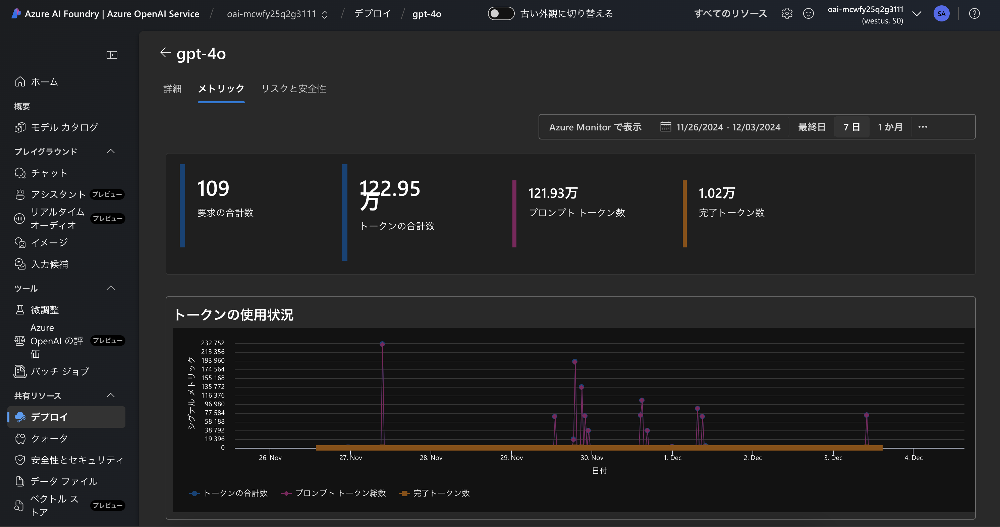

## Appendix 2: トレースを使用したアプリケーションのデバッグ

- AI Foundry ハブを作成

    - Azure Portal の検索バーに `AI Project` と入力し、**Azure AI Studio** を選択

    - 以下の項目を入力

        - **基本**

            - **サブスクリプション**: `ワークショップで使用中のサブスクリプション`
            - **リソースグループ**: `ワークショップで使用中のリソースグループ`
            - **リージョン**: `ワークショップで使用中のリージョン`
            - **名前**: `任意 (hub-cloudworkshop)`
            - **フレンドリ名**: `任意 (Hub cloudworkshop)`
            - **既定のプロジェクト リソース グループ**: `ワークショップで使用中のリソースグループ`
            - **OpenAI を含む AI サービスに接続する**: `展開済みの Azure OpenAI リソース (oai-mcwfy25q2gxx)`

            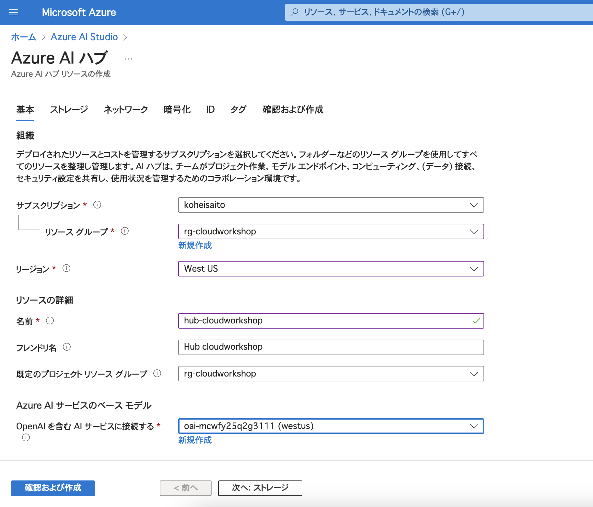
        
        - **ストレージ**

            - **ストレージ アカウント**: `既定 (新規)`
            - **Credential store**: `Azure key vault`
                - **キー コンテナー**: `既定 (新規)`
            - **Application Insights**: `展開済みの Application Insights (appi-mcwfy25q2gxxxx)`
            - **コンテナー レジストリ**: `なし`

            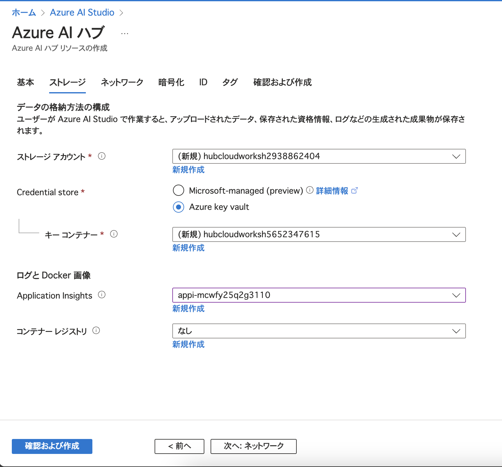

        - **ネットワーク**: `パブリック`

        - **暗号化**、**ID**、**タグ** は既定のまま

        - **確認および作成**を選択し、**作成**を押下

    - リソースが正常に作成されたことを確認し、**Azure AI Studio の起動**を選択

    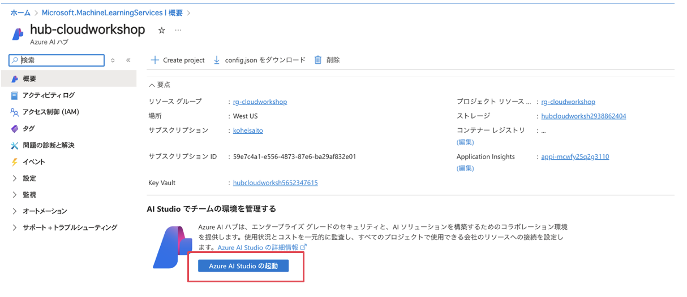

    - プロジェクト名（例: `prj-cloudworkshop`）を入力し、**プロジェクトの作成**を選択

    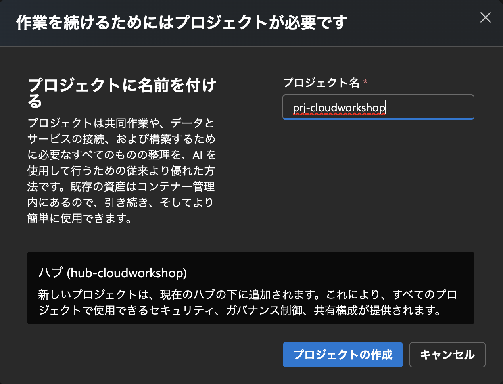

- Storage リソースに対してログイン中のユーザーに `Storage File Data Privileged Contributor` の権限を付与

    - 展開されたストレージアカウント（例: `hubcloudworkshxxxxx`）の **アクセス制御 (IAM)**から **+ 追加** > **ロールの割り当てを追加**を選択

    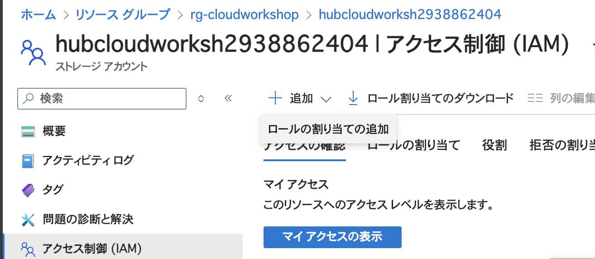

    - **Storage File Data Privileged Contributor** を選択し、**次へ**を押下

    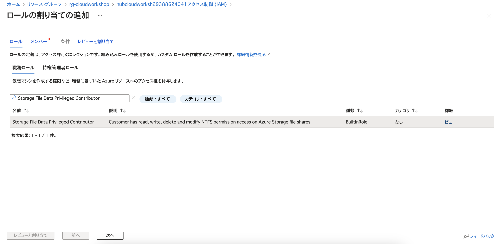

    - メンバータブでワークショップで使用中のユーザーを選択し、**次へ**を押下

    - **レビューと割り当て**を押下

- `.env` に `APPLICATIONINSIGHTS_CONNECTION_STRING` 環境変数を設定

    - Application Insights の概要ページから、**接続文字列** (`InstrumentationKey=xxxxx`)をコピー

    <details>
    <summary>Python</summary>

    - `app/python/simple/.env` の `APPLICATIONINSIGHTS_CONNECTION_STRING` に、コピーした Application Insights の接続文字列をセット

    - 作業用端末にコンテナイメージをビルドし、実行

    ```shell
    cd ./app/python/simple
    docker build -t python-simple:0.0.1 .
    docker run -p 8000:8000 python-simple:0.0.1
    ```

    - ブラウザからチャット API をコールし、レスポンスを取得することを確認

    > GET /chat?query={input} で、上記手順で試した会話を行うチャットボットとの対話を実施可能。APIは実装済み。

    ```
    http://localhost:8000/chat?query=こんにちは
    ```

    - ブラウザから検索 API をコール

    > GET /search/fulltext?query={input} で、input をクエリとする全文検索を実施可能。APIは実装済み。

    ```
    http://localhost:8000/search/fulltext?query=AOAIとは
    ```

    - AI Foundry のプロジェクトに移動し、**トレース**からパフォーマンスを確認

    

    </details>

    <details>
    <summary>C#</summary>


    - `app/csharp/simple/.env` の `APPLICATIONINSIGHTS_CONNECTION_STRING` に、コピーした Application Insights の接続文字列をセット

    - 作業用端末にコンテナイメージをビルドし、実行

    ```shell
    cd ./app/csharp/simple
    docker build -t csharp-simple:0.0.1 .
    docker run -p 8080:8080 csharp-simple:0.0.1
    ```

    - ブラウザからチャット API をコールし、レスポンスを取得することを確認

    > GET /chat?query={input} で、上記手順で試した会話を行うチャットボットとの対話を実施可能。APIは実装済み。

    ```
    http://localhost:8080/chat?query=こんにちは
    ```

    - ブラウザから検索 API をコール

    > GET /search/fulltext?query={input} で、input をクエリとする全文検索を実施可能。APIは実装済み。

    ```
    http://localhost:8080/search/fulltext?query=AOAIとは
    ```

    - AI Foundry のプロジェクトに移動し、**トレース**からパフォーマンスを確認

    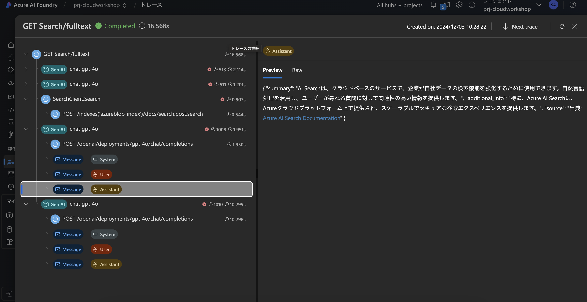

    </details>

## Appendix 3: Azure OpenAI、Document intelligence を使った評価用データセットを用いた生成 AI の評価

- 評価用データセットを作成
  
    > ハンズオンで Blob Storage にアップロードしたコンテンツに基づく評価用データセットを作成します。

    - `evaluator/synthetic_qa_from_document.ipynb` を実行

- 評価用 Azure OpenAI `gpt-4o-mini` モデルを展開

    - **モデル+エンドポイント**を選択し、**+ モデルのデプロイ**、**基本モデルをデプロイする**を押下

    - **gpt-4o-mini**を選択し、**確認**を押下

    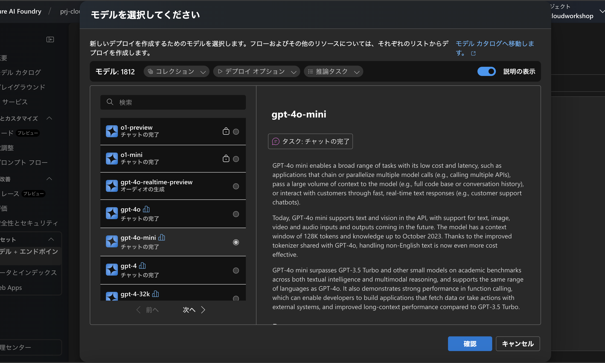

    - **カスタマイズ**から既存の Azure OpenAI リソースを選択し、**接続とデプロイ**を押下

    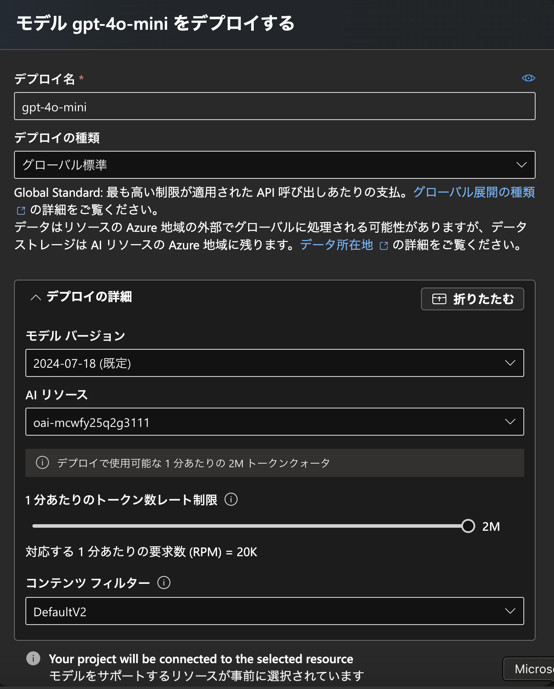

- 作成されたデータセットを AI Foundry にアップロードし、プロジェクトから**評価**を実行（「関連性」の評価）

    - `./evaluator/dataset/imagenet-training-summary-eval.jsonl` の内容を確認

    - AI Foundry のプロジェクトに移動し、左のメニューから**評価**を選択

    - **新しい評価を作成**、**データセット**を選択

    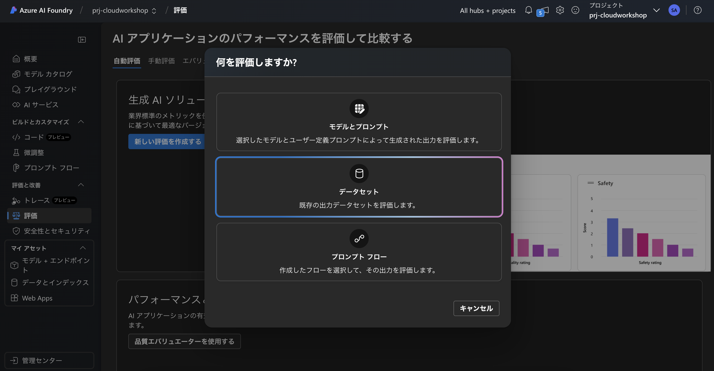

    - 基本情報の追加

        - **評価名**: `任意 (eval-001)`

        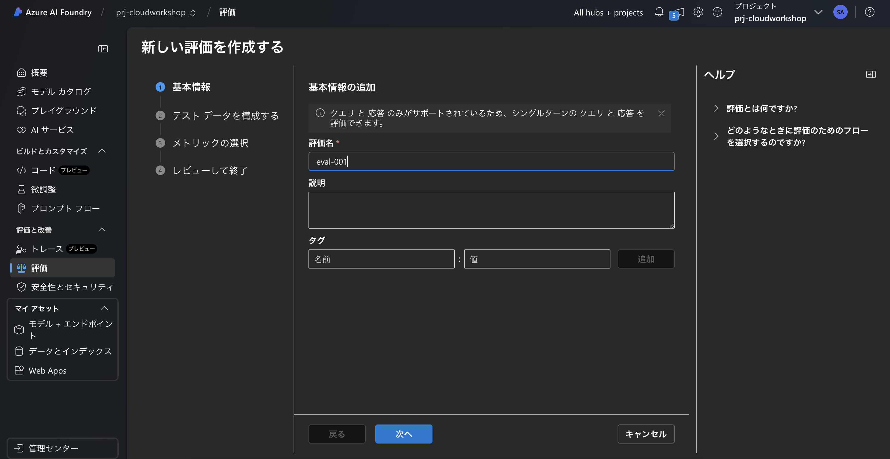

    - テスト データを構成する

        - **データセットの追加**を選択し、`./evaluator/dataset/imagenet-training-summary-eval.jsonl` をアップロード

        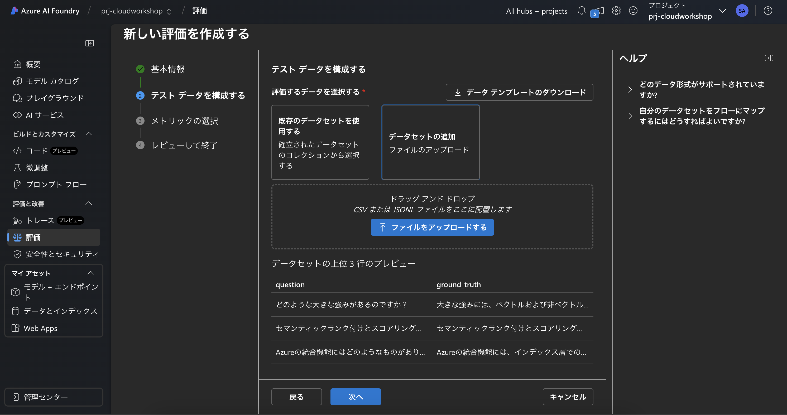

    - メトリックの選択

        - AI 品質: **関連性**
        - 接続: **既存の Azure OpenAI (`oai-mcwfy25q2gxx`)**
        - デプロイ名/モデル: **gpt-4o-mini**

        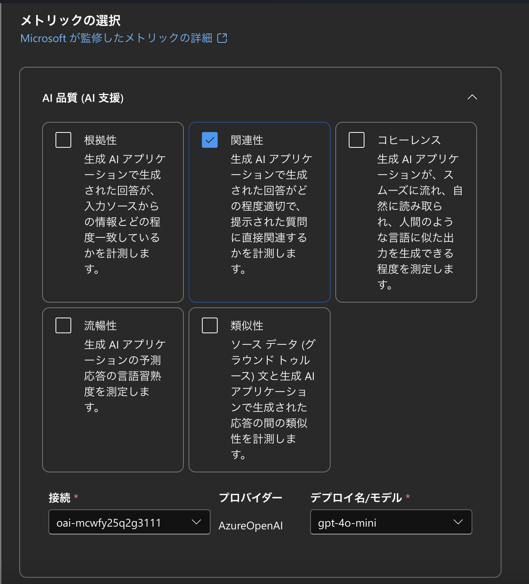

    - データセットは評価入力にどのようにマップされていますか?

        - response: **ground_truth**
        - query: **question**

        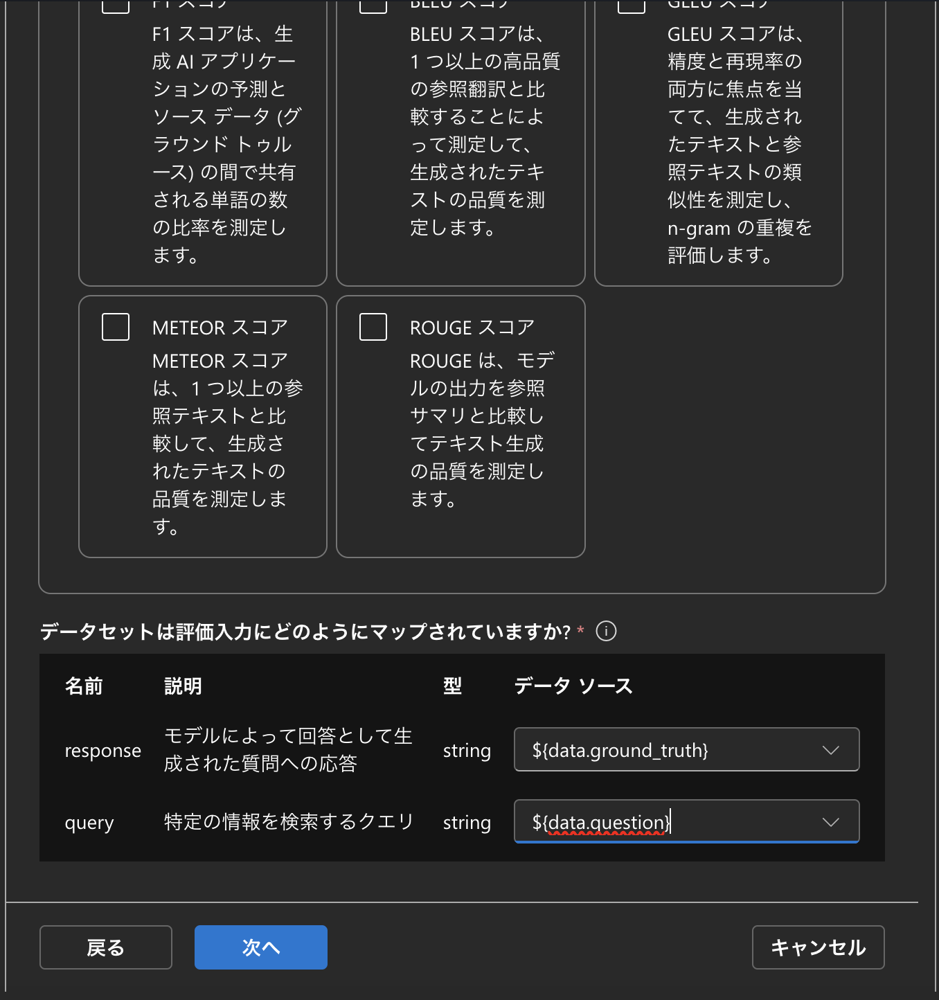

    - **次へ**を選択し、**送信**を押下

    > 30秒ほどすると LLM による評価が完了し、結果を確認できます。モデルを gpt-4o に変更するなどして、様々な評価を試してみてください。
    
    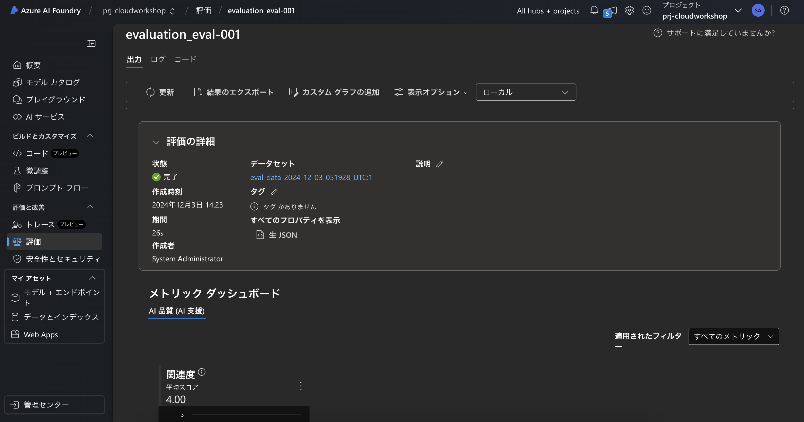

