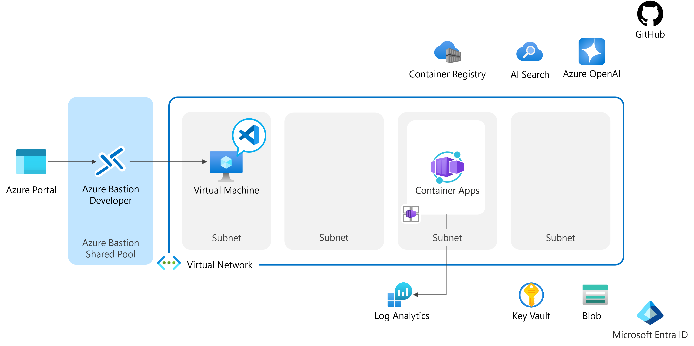
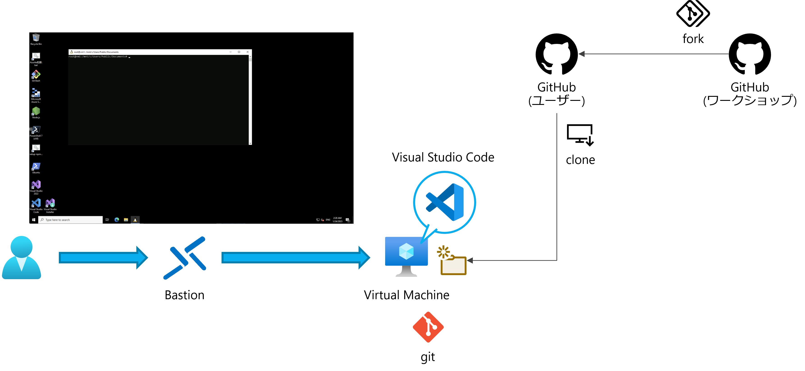
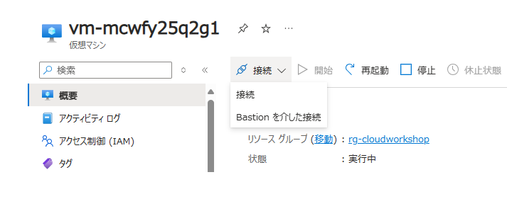
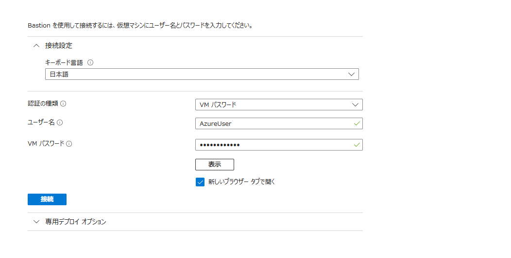
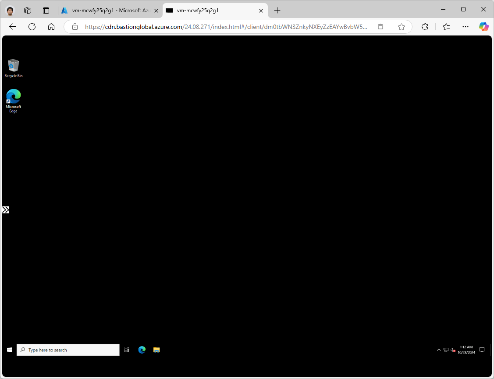
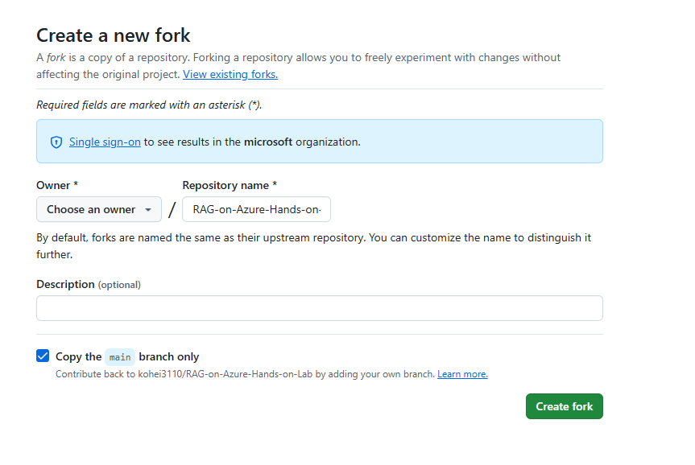
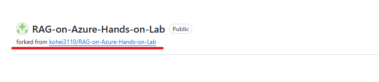
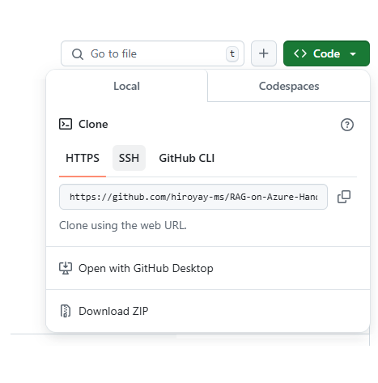
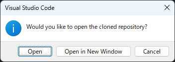

Retrieval Augmented Generation (RAG) pattern for Azure AI Search  
Dec 2024

<br />

### Contents

- [環境準備](#環境準備)

<br />

### 事前準備環境



<br />

## 環境準備



<br />

#### 仮想マシンへの接続

- [Azure ポータル](https://portal.azure.com/) から展開済みの仮想マシンへ管理ブレードを表示

- **接続** > **Bastion を介した接続** を選択

  

- ユーザー名、パスワードを入力し **接続** をクリック

  

- 新しいタブが開き、仮想マシンのデスクトップ画面が表示

  

  - 初回接続時にポップアップ ブロック機能により画面が表示されない場合:
  
    ポップアップ ブロックのアイコンをクリックし、ポップアップとリダイレクトを許可したのち再度接続を実行

<br />

#### GitHub リポジトリのフォーク

- Web ブラウザを起動、[ワークショップのリポジトリ](https://github.com/kohei3110/RAG-on-Azure-Hands-on-Lab) へアクセス

- **Fork** をクリック

  

- **Owner** に自身のアカウントが表示、**Copy the main branch only** にチェックがつけられていることを確認し **Create fork** をクリック

  

- リポジトリが複製されることを確認

  

<br />

#### リポジトリのクローン

- リポジトリの **Code** をクリック、表示されるツールチップよりリポジトリの URL をコピー

  

- Visual Studio Code を起動、サイドバーから **Explorer** を選択し **Clone Repository** をクリック

  

- リポジトリの URL にコピーした URL を貼り付け Enter キーを押下

  

- 複製先となるローカル ディレクトリを選択

  ※ GitHub の認証情報が求められた場合は、資格情報を入力し認証を実施

- クローンされたリポジトリを開きますか？のメッセージが表示されるので **Open** をクリック

  

- **Terminal** > **New Terminal** を選択

- git remote コマンドを実行し  クローン先である自身のアカウント名を含む URL が表示されることを確認

  ```
  git remote -v
  ```

<br />

## Exercise 1: Azure AI Search の使用方法

<br />

### 参考情報

- [Azure AI Search の概要](https://learn.microsoft.com/ja-jp/azure/search/search-what-is-azure-search)

- [インデクサーの概要](https://learn.microsoft.com/ja-jp/azure/search/search-indexer-overview)

<br />

## Exercise 2: Azure OpenAI Searvice

<br />

## Exercise 3: API

<br />

## Exercise 4: Azure への展開

<br />